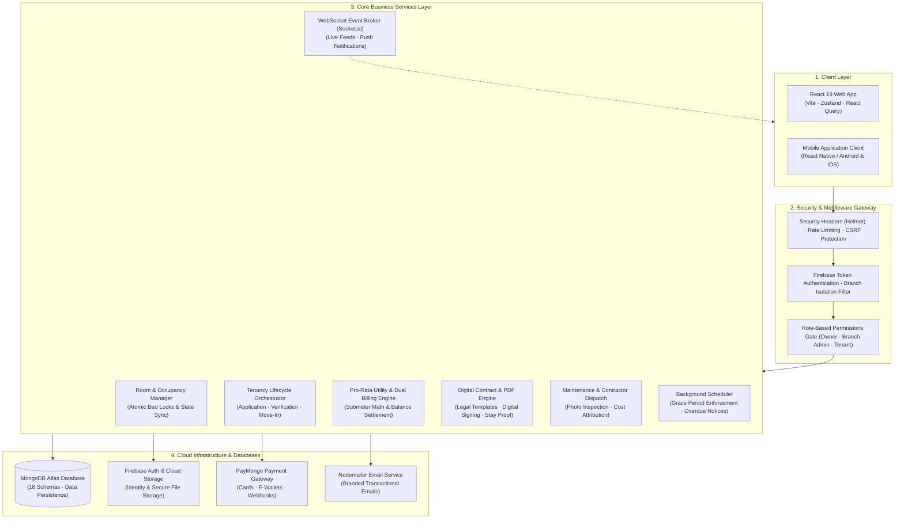
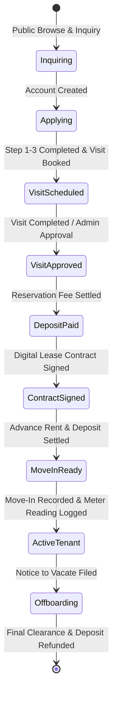
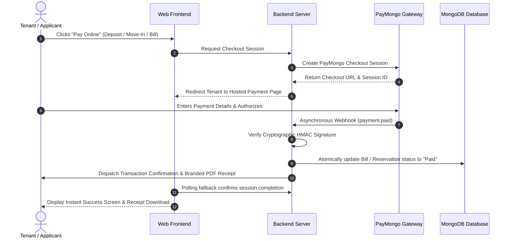

# 🏢 Lilycrest Dormitory Management System (Lilycrest DMS)

> An enterprise-grade, full-stack dormitory management and tenancy operations platform designed for multi-branch residential facilities. Built with React 19, Express.js, MongoDB Atlas, Firebase, and PayMongo.

---

<p align="center">
  
  
  
  
  
  
  
  
  
</p>

---

## 📖 Table of Contents

1. [System Overview & Purpose](#-1-system-overview--purpose)
2. [High-Level System Architecture](#-2-high-level-system-architecture)
3. [User Roles & Access Hierarchy](#-3-user-roles--access-hierarchy)
4. [Core Operational Workflows & Domain Logic](#-4-core-operational-workflows--domain-logic)
   - [A. End-to-End Tenancy Lifecycle](#a-end-to-end-tenancy-lifecycle)
   - [B. Multi-Branch Data Isolation](#b-multi-branch-data-isolation)
   - [C. Dual Billing Model & Pro-Rata Utility Math](#c-dual-billing-model--pro-rata-utility-math)
   - [D. Payment Processing & Asynchronous Settlement](#d-payment-processing--asynchronous-settlement)
   - [E. Digital Contracts & Verified Proof of Stay](#e-digital-contracts--verified-proof-of-stay)
   - [F. Maintenance Management & Contractor Attribution](#f-maintenance-management--contractor-attribution)
   - [G. Real-Time Communication & Notifications](#g-real-time-communication--notifications)
5. [Frontend Architecture & Design System](#-5-frontend-architecture--design-system)
6. [Backend Architecture & Data Integrity](#-6-backend-architecture--data-integrity)
7. [Developer Setup & Quick Start](#-7-developer-setup--quick-start)
8. [Testing & Quality Assurance](#-8-testing--quality-assurance)
9. [Documentation Directory](#-9-documentation-directory)
10. [License](#-10-license)

---

## 🏢 1. System Overview & Purpose

**Lilycrest Dormitory Management System (Lilycrest DMS)** was built to modernize and unify daily dormitory operations across multiple branch facilities (such as *Guadalupe* and *Gil Puyat* in Metro Manila).

Before digitizing, dormitory administrators faced common operational hurdles:
- **Manual reservation handling** and double-booked beds during peak enrollment seasons.
- **Complex utility math**, where electricity consumption had to be divided fairly across roommates with differing move-in dates.
- **Unstructured cash and deposit collections** without instant receipt tracking.
- **Physical paper contracts** easily misplaced or delayed during onboarding.
- **Scattered maintenance requests** leading to missed repairs and unclear contractor expenses.

**Lilycrest DMS solves this** by centralizing all operations into a single platform:
- Real-time, bed-level room occupancy visualization.
- Automated 4-step tenant onboarding from reservation to digital key handover.
- Automated pro-rata utility calculation engine.
- Instant PayMongo checkout with automatic webhook reconciliation.
- Browser-based legal lease generation and digital signature capture.
- Transparent maintenance workspace with photo verification and contractor cost attribution.

---

## 🏛 2. High-Level System Architecture

The following diagram illustrates how data flows between users, client applications, server middleware, domain services, and external cloud infrastructure:



---

## 👥 3. User Roles & Access Hierarchy

The system enforces a strict 4-tier Role-Based Access Control (RBAC) hierarchy. A user's role dictates the navigation, dashboard views, and data operations available to them:

```
[Public Visitor]
       ↓ (Registers account)
  [Applicant]
       ↓ (Approved, pays reservation fee, signs lease, completes move-in)
    [Tenant]
       ↓ (Elevated by Owner)
 [Branch Admin]
       ↓ (Multi-branch executive)
    [Owner]
```

| Role | Primary Purpose | Scope & Access Rights |
|---|---|---|
| **Public Visitor** | Discovery & Inquiries | Browse room types, check live availability, view branch amenities, submit general inquiries, book on-site visits, and verify stay certificates. |
| **Applicant** | Onboarding & Reservation | Complete the 4-step reservation flow, upload identification and proof of enrollment, schedule physical visits, pay reservation deposits, and track application approval status. |
| **Tenant** | Active Tenancy Management | View active room & bed assignment, access monthly rent and utility breakdown, pay bills online, submit maintenance requests with photos, sign digital lease contracts, and acknowledge branch bulletins. |
| **Branch Admin** | Branch Operations Supervisor | Manage all tenant lifecycles within their assigned branch, record room electricity meter readings, generate pro-rata bills, manage maintenance tickets and contractor dispatch, and export operational reports. |
| **Owner** | System Governance & Ownership | Full cross-branch access, branch registration and configuration, user and permission management, system-wide financial analytics, immutable audit logs, and system backups. |

---

## ⚙️ 4. Core Operational Workflows & Domain Logic

### A. End-to-End Tenancy Lifecycle

The transition from a prospective applicant to an offboarded tenant follows a structured, state-driven lifecycle:



1. **Room & Bed Selection**: The applicant selects a specific branch, room type, and available bed. The system locks the selected bed temporarily to prevent simultaneous bookings.
2. **Document & Identity Submission**: The applicant uploads required government ID and proof of enrollment/employment. An automated OCR pre-check validates document readability for administrative review.
3. **Physical Visit & Interview**: Applicants can book an on-site branch visit. Branch admins mark the visit complete or grant permission to proceed.
4. **Reservation Deposit**: The applicant pays the initial reservation fee via PayMongo. Once paid, the bed is marked as officially reserved.
5. **Digital Lease Signing**: A formal lease contract is automatically generated. The tenant reviews and signs digitally in their browser.
6. **Move-In Balance Settlement**: Before move-in, the tenant settles the remaining Move-In balance (Advance Rent + Security Deposit minus the initial reservation fee).
7. **Move-In & Check-In**: The branch admin records the initial electricity submeter reading, hands over physical keys, and marks the status as **Moved In**, elevating the user account to an active **Tenant**.
8. **Active Tenancy & Offboarding**: The tenant receives monthly rent and pro-rata utility bills. Upon lease conclusion, offboarding clearance is conducted and security deposit refunds are logged.

---

### B. Multi-Branch Data Isolation

Lilycrest DMS operates with multi-branch tenancy:
- Every room, tenant, bill, announcement, and maintenance request is associated with a specific branch (e.g., `Guadalupe`, `Gil Puyat`).
- **Branch Admins** are bound to their assigned branch. Backend middleware automatically scopes all queries and mutations to that branch, preventing cross-branch data leaks.
- **Owners** have global access and can switch branch views or view consolidated, cross-branch performance summaries.

---

### C. Dual Billing Model & Pro-Rata Utility Math

The system uses a **Dual-Module Billing Architecture**:

```
Monthly Tenant Obligation = Base Room Rent + Pro-Rata Electricity Utility Charge
```

#### 1. Base Room Rent
- Set during room creation based on room type (Single, Double, Quadruple-sharing) and lease duration.
- Billed on a regular monthly cycle.

#### 2. Electricity Utility Pro-Rata Distribution
Rooms feature dedicated submeters. Rather than charging arbitrary flat utility fees, electricity costs are calculated and split transparently:
1. **Meter Delta**: The admin inputs the current room meter reading. The consumption is calculated as:
   $$\text{Consumption (kWh)} = \text{Current Reading} - \text{Previous Reading}$$
2. **Total Room Cost**:
   $$\text{Total Cost (PHP)} = \text{Consumption (kWh)} \times \text{Electricity Rate per kWh}$$
3. **Pro-Rata Tenant Distribution**:
   Each tenant sharing the room is charged proportional to the number of active days they resided in the room during the billing period:
   $$\text{Tenant Share} = \text{Total Room Cost} \times \left( \frac{\text{Tenant Active Days in Cycle}}{\sum \text{All Roommate Active Days}} \right)$$

This ensures that tenants who moved in mid-cycle only pay for the exact days they consumed power.

---

### D. Payment Processing & Asynchronous Settlement

Online transactions are powered by PayMongo checkout sessions supporting Credit/Debit Cards, GCash, and Maya:



---

### E. Digital Contracts & Verified Proof of Stay

- **Automated Lease Generation**: When a reservation is confirmed, the contract service compiles tenant information, room specifications, monthly rates, house rules, and legal terms into a standardized document.
- **In-Browser Signature Capture**: Tenants review the legal clauses and sign using a digital canvas.
- **Cryptographic Stay Proof (`/verify-stay/:token`)**: Each active contract produces a secure verification token. External institutions (such as universities or employers) can scan the QR code on a tenant's Certificate of Stay to verify legitimate tenancy without revealing private demographic details.

---

### F. Maintenance Management & Contractor Attribution

1. **Ticket Creation**: Tenants log maintenance issues categorized by discipline (*Electrical*, *Plumbing*, *Carpentry*, *Air Conditioning*, *General*) with priority levels and photo attachments.
2. **Admin Review & Contractor Dispatch**: Branch admins review incoming tickets, inspect uploaded photos, and assign external contractors or internal staff.
3. **Cost Attribution & Completion**: Once repairs are completed, administrators log resolution notes, before/after proof photos, and contractor service costs. The cost can be attributed as a building expense or billed directly to a tenant if caused by negligence.

---

### G. Real-Time Communication & Notifications

- **WebSocket Integration (Socket.io)**: Powers real-time admin alert feeds, instant unread notification badge updates, and live reservation status changes without requiring page refreshes.
- **Transactional Emails (Nodemailer)**: Branded HTML email notifications dispatched for visit approvals, payment receipts, monthly billing statements, password resets, and account verification links.

---

## 🎨 5. Frontend Architecture & Design System

The frontend is a modern React 19 Single Page Application (SPA) built on Vite, designed with an **Enterprise-Grade, Minimalist, High-Contrast Solid HSL Design System**:

- **Strictly Zero Gradients**: Avoids visual clutter with flat, solid HSL color palettes, clean 1px borders, and high contrast for maximum readability.
- **Modular Feature Architecture**:
  ```
  web/src/
  ├── features/
  │   ├── admin/           # Admin dashboard, room setups, billing workbench, maintenance
  │   ├── public/          # Landing page, availability search, registration, legal pages
  │   ├── super-admin/     # System settings, branch management, audit logs, role editors
  │   └── tenant/          # Tenant portal, reservation wizard, lease signing, payment desk
  ├── shared/              # Reusable UI components, API layer, custom hooks, Zustand stores
  └── App.jsx              # Central router with route-level error boundaries & Suspense skeletons
  ```
- **State Management Separation**:
  - **Server State**: Managed via TanStack React Query for caching, optimistic updates, and background refetching.
  - **Client UI State**: Lightweight Zustand stores for notification trays, modals, and sidebar toggles.
- **Per-Route Error Boundaries**: Each route is isolated so an unexpected component crash in one view never crashes the entire application.

---

## 🛡️ 6. Backend Architecture & Data Integrity

The backend is built with Express.js and MongoDB (Mongoose ODM), structured around clean separation of concerns:

- **18 Mongoose Models**: Strictly typed schemas with automated validation, pre-save hooks, and compound indexes for fast queries.
- **Atomic Concurrency Controls**: Bed reservations and room occupancy adjustments utilize atomic MongoDB operators (`$inc`, `$set`) to eliminate race conditions.
- **Security & Hardening Pipeline**:
  - **Helmet**: Secures HTTP response headers.
  - **Rate Limiting**: Multi-tiered rate limiters protecting authentication routes, public inquiry endpoints, and standard API traffic.
  - **Input Sanitization**: Cleans incoming payloads to defend against NoSQL injection and Cross-Site Scripting (XSS).
  - **Immutable Audit Logging**: Captures who did what, when, from which IP, including before-and-after snapshots of modified data.

---

## 💻 7. Developer Setup & Quick Start

### Prerequisites
- [Node.js](https://nodejs.org/) `>= 18.0.0`
- [MongoDB](https://www.mongodb.com/atlas) cluster URI or local instance
- [Firebase Console](https://console.firebase.google.com/) Project (Auth & Storage enabled)
- [PayMongo](https://www.paymongo.com/) API keys (Test mode available)

---

### Step-by-Step Installation

```bash
# 1. Clone the repository
git clone https://github.com/kuurz-z/Capstone-Website.git
cd Capstone-Website

# 2. Install backend dependencies
cd server
npm install

# 3. Install frontend dependencies
cd ../web
npm install
```

---

### Running the Local Development Servers

```bash
# Terminal 1 — Start the Backend Server
cd server
npm run dev

# Terminal 2 — Start the Frontend Client
cd web
npm run dev
```

| Service | Local Address |
|---|---|
| **Web Frontend** | `http://localhost:3000` |
| **Backend REST API** | `http://localhost:5000` |
| **System Health Check** | `http://localhost:5000/api/health` |

---

## 🧪 8. Testing & Quality Assurance

Lilycrest DMS maintains automated test coverage across authentication, reservation state machines, and financial calculation logic.

```bash
# Run the complete backend test suite (166 test suites, 1600+ test cases)
cd server
npm test

# Run frontend production build check
cd web
npm run build
```

---

## 📚 9. Documentation Directory

For deeper architectural specifications, refer to the guides in the [`docs/`](docs/) directory:

- 📐 [**System Architecture**](docs/SYSTEM_ARCHITECTURE.md) — Architectural patterns, database schemas, and service layers.
- 📖 [**API Documentation**](docs/API_DOCUMENTATION.md) — Payload structures and error response specifications.
- 💳 [**Billing Master Guide**](docs/BILLING_SYSTEM_MASTER_GUIDE.md) — In-depth guide to pro-rata utility formulas and penalty policies.
- 🔐 [**Authentication & Security**](docs/AUTHENTICATION_AND_SECURITY.md) — Firebase Auth, token lifecycle, and RBAC implementation.
- 🛌 [**Occupancy & Reservation Guide**](docs/OCCUPANCY_AND_RESERVATION_GUIDE.md) — Bed-level management and lifecycle state machines.
- 🛠️ [**Maintenance & Chat Guide**](docs/MAINTENANCE_AND_SUPPORT_CHAT.md) — Ticket lifecycle and contractor cost attribution.

---

## 📄 10. License

Developed as a capstone project for **Lilycrest Dormitory**. All rights reserved.

<p align="center">
  <strong>Lilycrest Dormitory Management System</strong><br>
  Built with React 19 · Node.js · Express.js · MongoDB Atlas · Firebase · PayMongo · Socket.io
</p>
