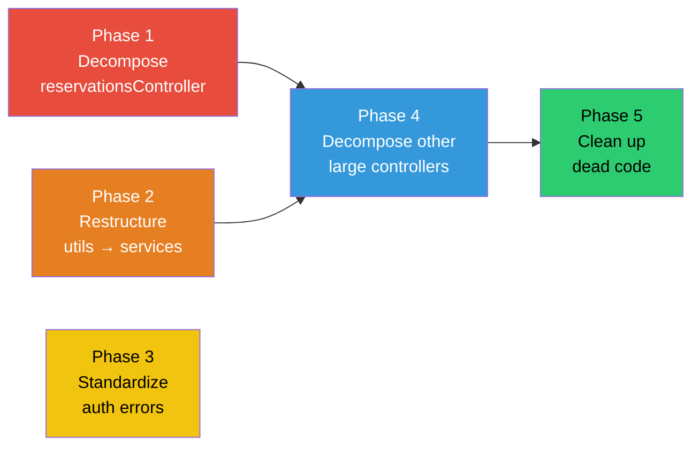

# Backend Refactoring Plan

> **Goal:** Improve maintainability, testability, and scalability of the Lilycrest DMS backend without changing any external API contracts or breaking the frontend.
> 
> **Guiding Principle:** Every step must leave the system in a working, deployable state. No big-bang rewrites.

---

## Phase 1: Decompose the Reservations God Controller

> **Target:** `reservationsController.js` (211 KB → 5–6 files, each under 40 KB)  
> **Risk:** HIGH — this is the most-touched file in the backend  
> **Estimated Effort:** 3–4 focused sessions

### Step 1.1 — Inventory & Categorize Every Export

- Open `reservationsController.js` and list every exported function
- Group each function into one of these logical domains:
  - **CRUD** — `getReservations`, `getReservationById`, `createReservation`, `deleteReservation`
  - **Lifecycle** — `updateReservation`, `extendReservation`, `releaseSlot`
  - **Visit Management** — `manageReservationVisit`, `getVisitAvailability`, `getVisitAvailabilityRules`, `updateVisitAvailabilityRules`, `precheckReservationDocument`
  - **Cancellation** — `cancelReservationByUser`, `requestCancellationByUser`, `approveCancellationRequest`, `rejectCancellationRequest`
  - **Tenant Workspace** — `getCurrentResidents`, `getTenantWorkspace`, `getTenantWorkspaceById`, `getTenantActionContext`, `getMyContract`
  - **Tenancy Actions** — `archiveReservation`, `restoreReservation`, `renewContract`, `moveOutReservation`, `transferTenant`
- Document any shared private helper functions and which domains use them

### Step 1.2 — Identify Shared Internal Helpers

- Mark every private (non-exported) function in the file
- Classify each as:
  - **Domain-specific** → moves with its domain controller
  - **Shared across 2+ domains** → will be extracted to a shared helpers module
- This step determines whether you need a `controllers/reservations/_helpers.js` file

### Step 1.3 — Create the Directory Structure (Empty Files)

- Create the folder `controllers/reservations/`
- Create empty files:
  ```
  controllers/reservations/
  ├── index.js                         ← Re-exports everything (backward compat)
  ├── reservationCrudController.js
  ├── reservationLifecycleController.js
  ├── visitManagementController.js
  ├── cancellationController.js
  ├── tenantWorkspaceController.js
  ├── tenancyActionsController.js
  └── _helpers.js                      ← Shared private helpers (if needed)
  ```

### Step 1.4 — Migrate One Domain at a Time

- Start with the **lowest-risk domain** (Tenant Workspace — read-only queries)
- Move functions + their imports into the new file
- Re-export from `index.js`
- Run existing tests to confirm nothing breaks
- Repeat for each domain in this order:
  1. Tenant Workspace (read-only, lowest risk)
  2. Visit Management
  3. Cancellation
  4. Tenancy Actions (archive, restore, renew, move-out, transfer)
  5. CRUD
  6. Lifecycle (most interconnected, highest risk — do last)

### Step 1.5 — Update Route Imports

- Change `reservationsRoutes.js` imports from the monolith to the new `index.js` barrel
- This should be a single-line change since the barrel re-exports everything
- Run full test suite to confirm

### Step 1.6 — Verify & Clean Up

- Delete the original `reservationsController.js` (or rename to `.bak` temporarily)
- Run all reservation-related tests
- Run the dev server and manually test a reservation flow end-to-end
- Remove `.bak` once confident

---

## Phase 2: Restructure `utils/` into Service Layers

> **Target:** `server/utils/` (56 files → organized `services/` and a lean `utils/`)  
> **Risk:** MEDIUM — mostly internal refactoring, no API changes  
> **Estimated Effort:** 3–4 focused sessions

### Step 2.1 — Classify Every File in `utils/`

Go through all 56 files and tag each one:

| Tag | Definition | Destination |
|:----|:-----------|:------------|
| **`service`** | Contains business logic, DB queries, or orchestration | `services/<domain>/` |
| **`rule`** | Contains business rules or policy logic | `services/<domain>/` (alongside service) |
| **`infra`** | Infrastructure concern (socket, PDF, email) | `infra/` or stays in `utils/` |
| **`pure-util`** | Pure functions, no DB or side effects | Stays in `utils/` |
| **`migration`** | One-time or rarely-used migration logic | `utils/migrations/` (already exists) |

### Step 2.2 — Define the Target Service Domains

```
services/
├── billing/
│   ├── billingEngine.js
│   ├── billingPolicy.js
│   ├── billSettlement.js
│   ├── rentGenerator.js
│   ├── penaltyCalculator.js
│   ├── billingAudit.js
│   └── paymentLedger.js
├── occupancy/
│   ├── occupancyManager.js
│   └── bedLockCleanup.js
├── notifications/
│   ├── notificationService.js
│   ├── notificationVisibility.js
│   ├── mobilePushService.js
│   └── announcementDispatch.js
├── reservations/
│   ├── reservationHelpers.js
│   ├── visitAvailability.js
│   ├── reservationArchive.js
│   ├── tenantActionService.js
│   └── tenantWorkspace.js
├── scheduling/
│   ├── scheduler.js
│   ├── gracePeriodJob.js
│   └── slaAlertJob.js
├── utility-billing/
│   ├── utilityBillFlow.js
│   ├── utilityFlowRules.js
│   ├── utilityDiagnostics.js
│   └── utilityLifecycle.js
├── ai/                          ← Already partially exists
│   ├── analyticsInsightsService.js
│   ├── billingIntelligenceService.js
│   └── maintenanceAiService.js
└── audit/
    └── auditLogger.js
```

### Step 2.3 — Migrate One Domain at a Time

- Same principle as Phase 1: move files one domain at a time
- For each file moved:
  1. Move the file to its new location
  2. Update all `import` paths across the codebase that reference it (`grep` for the old path)
  3. Run tests to confirm nothing breaks
- Start with the most isolated domain (e.g., `audit/auditLogger.js` — probably few consumers)
- Save the most interconnected domain (`billing/`) for last

### Step 2.4 — Clean Up Residual `utils/`

After migration, `utils/` should contain only:
- Pure utility functions (`sanitize.js`, `roomLabel.js`, `userReference.js`, `adminAccess.js`)
- `businessSettings.js` (config retrieval, borderline — could stay or move to `services/settings/`)
- `lifecycleNaming.js` (shared constant/enum module)
- Infrastructure: `socket.js`, `pdfGenerator.js`
- `migrations/` subdirectory

---

## Phase 3: Standardize Auth Error Responses

> **Target:** `middleware/auth.js`  
> **Risk:** LOW — isolated change, no business logic affected  
> **Estimated Effort:** 1 session

### Step 3.1 — Audit Current Auth Error Responses

- List every `res.status().json()` call in `auth.js`
- Compare each one's shape against the standardized `sendError()` format

### Step 3.2 — Replace with `sendError()` Calls

- Import `sendError` from `errorHandler.js`
- Replace each raw response with the equivalent `sendError()` call
- Preserve all existing HTTP status codes and error codes

### Step 3.3 — Verify Frontend Compatibility

- Check if the frontend (`httpClient.js`) parses auth errors differently from business errors
- If so, ensure the frontend's error parsing handles the new uniform shape
- Run login/logout/permission-denied flows to confirm

---

## Phase 4: Apply the Same Decomposition to Other Large Controllers

> **Target:** `maintenanceController.js` (125 KB), `billingController.js` (98 KB)  
> **Risk:** MEDIUM  
> **Estimated Effort:** 2 sessions each

### Step 4.1 — Apply the Phase 1 Pattern to `maintenanceController.js`

- Same inventory → categorize → create structure → migrate → verify cycle
- Likely domains: CRUD, Contract Management, SLA/Priority, AI Review, Analytics

### Step 4.2 — Apply to `billingController.js`

- Likely domains: Bill Generation, Bill Management, Payment Processing, Utility Billing Integration, Reporting

---

## Phase 5: Clean Up Dead Code & Dependencies

> **Risk:** LOW  
> **Estimated Effort:** 1 session

### Step 5.1 — Remove Stale Root-Level Scripts

- Archive or delete: `check.js`, `check_db.js`, `check-endpoint.js`, `test-endpoint.js`, `test3.cjs`, `test_delete.cjs`, `script.cjs`
- Move to a `scripts/archived/` if you want to preserve them

### Step 5.2 — Verify Unused Backend Dependencies

- Check if any backend dependency is unused (e.g., is `tesseract.js` still actively used, or has Gemini AI replaced it?)
- Remove confirmed dead dependencies from `package.json`

---

## Execution Rules

> [!IMPORTANT]
> 1. **One step at a time.** Complete and test each step before moving to the next.
> 2. **No API contract changes.** The frontend must not need any updates during Phases 1–3.
> 3. **Barrel re-exports for backward compat.** Every new directory gets an `index.js` that re-exports everything the old single file exported.
> 4. **Run tests after every move.** The test suite is your safety net.
> 5. **Git commit after each step.** Small, atomic commits with clear messages (e.g., `refactor(reservations): extract tenant-workspace controller`).

---

## Phase Dependency Map



**Phases 1, 2, and 3 can run in parallel.** Phase 4 benefits from having both 1 and 2 done first (established patterns). Phase 5 is a clean-up pass after all structural work is complete.
