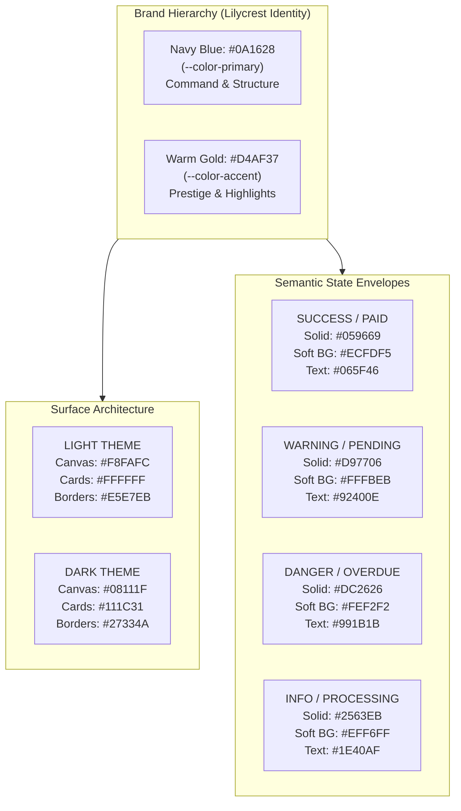

# Lilycrest DMS — System Color Palette & Color Objectives Specification

This document serves as the master visual design and engineering reference for the color system, semantic tokens, component ergonomics, and accessibility standards across the **Lilycrest Dormitory Management System (Lilycrest DMS)**.

---

## 1. System Color Objectives & Philosophy

Lilycrest DMS operates under five foundational color rules:

1. **Prestigious & Trustworthy Brand Identity**:
   - Anchored by **Navy Blue (`#0A1628`)** and **Warm Gold (`#D4AF37`)**, projecting enterprise reliability, architectural quality, and dormitory hospitality.
2. **Strictly Solid Flat Colors (Zero Gradients)**:
   - **No gradient backgrounds, no gradient cards, no gradient text, and no gradient buttons**. All surfaces and actions use solid, high-contrast HSL values.
3. **High Contrast & WCAG 2.1 AA Compliance**:
   - Text against backgrounds strictly exceeds **4.5:1** contrast for body copy and **3:1** for UI components and headers.
4. **Predictable Semantic Envelopes**:
   - Standardized colors for status tracking across contracts, room occupancy, billing sub-meters, and maintenance.
5. **No Cliché AI Aesthetics**:
   - Prohibits purple-on-dark, neon glows, headline biscuit pills, and cluttered icon boxes.

---

## 2. Visual Palette Swatches & Tone Maps

```
==================================================================================================
                               LILYCREST DMS COLOR TOKEN SWATCHES
==================================================================================================

[ BRAND COLORS ]
  Primary Navy   : ████████████  #0A1628  | hsl(218, 60%, 10%)  | Main brand, headers, navbar, primary CTA
  Primary Hover  : ████████████  #13243D  | hsl(216, 52%, 16%)  | Hover state for primary navy
  Accent Gold    : ████████████  #D4AF37  | hsl(46, 65%, 52%)   | Accent gold, key metrics, focus outline
  Accent Hover   : ████████████  #B9921F  | hsl(45, 71%, 42%)   | Hover state for gold actions
  Accent Light   : ████████████  #F3E4B0  | hsl(46, 74%, 82%)   | Soft gold pill backgrounds
  Accent Soft    : ████████████  #F7EEC8  | hsl(46, 73%, 88%)   | Card header accent highlights
  Accent Subtle  : ████████████  #FBF7EA  | hsl(45, 69%, 95%)   | Subtle warm tint container

[ SEMANTIC STATUS ENVELOPES ]
  Success Solid  : ████████████  #059669  | hsl(160, 84%, 39%)  | Paid, Active, Verified, Online
  Success Soft BG: ░░░░░░░░░░░░  #ECFDF5  | hsl(152, 81%, 96%)  | Success pill & table row background
  Success Text   : ████████████  #065F46  | hsl(163, 88%, 20%)  | High-contrast text on success BG

  Warning Solid  : ████████████  #D97706  | hsl(38, 92%, 44%)   | Pending, Under Review, Maintenance
  Warning Soft BG: ░░░░░░░░░░░░  #FFFBEB  | hsl(48, 100%, 96%)  | Warning pill background
  Warning Text   : ████████████  #92400E  | hsl(28, 82%, 31%)   | High-contrast text on warning BG

  Danger Solid   : ████████████  #DC2626  | hsl(0, 72%, 51%)    | Overdue, Rejected, Terminated, Delete
  Danger Soft BG : ░░░░░░░░░░░░  #FEF2F2  | hsl(0, 86%, 97%)    | Danger pill background
  Danger Text    : ████████████  #991B1B  | hsl(0, 74%, 35%)    | High-contrast text on danger BG

  Info Solid     : ████████████  #2563EB  | hsl(221, 83%, 53%)  | In-flight process, Announcements
  Info Soft BG   : ░░░░░░░░░░░░  #EFF6FF  | hsl(214, 100%, 97%) | Info pill background
  Info Text      : ████████████  #1E40AF  | hsl(224, 76%, 40%)  | High-contrast text on info BG

[ SURFACES & NEUTRALS — LIGHT MODE ]
  Canvas BG      : ░░░░░░░░░░░░  #F8FAFC  | hsl(210, 40%, 98%)  | Main viewport background
  Card Surface   : ░░░░░░░░░░░░  #FFFFFF  | hsl(0, 0%, 100%)    | Elevate data cards & modals
  Muted / Input  : ░░░░░░░░░░░░  #F1F5F9  | hsl(210, 40%, 96%)  | Textboxes, select fields, disabled tabs
  Card Border    : ░░░░░░░░░░░░  #E5E7EB  | hsl(220, 13%, 91%)  | 1px solid card outlines
  Divider        : ░░░░░░░░░░░░  #F1F5F9  | hsl(210, 40%, 96%)  | Subtle row dividers

[ SURFACES & NEUTRALS — DARK MODE ]
  Dark Canvas    : ████████████  #08111F  | hsl(217, 59%, 7%)   | Dark viewport background
  Dark Section   : ████████████  #0B1628  | hsl(218, 57%, 10%)  | Alternate section backgrounds
  Dark Card      : ████████████  #111C31  | hsl(219, 48%, 13%)  | Dark card surfaces
  Dark Border    : ████████████  #27334A  | hsl(219, 31%, 22%)  | Dark container 1px borders
==================================================================================================
```

---

## 3. Visual System Architecture Diagram



---

## 4. Typography & Readability Matrix

```
+---------------------------------------------------------------------------------------------------+
| Text Token        | Light Mode Hex | Dark Mode Hex | WCAG Contrast | Usage Context                |
+-------------------+----------------+---------------+---------------+------------------------------+
| --text-heading    | #0A1628        | #F8FAFC       | 16.8:1 (AAA)  | Page titles, KPI statistics  |
| --text-body       | #1E293B        | #D0D7E2       | 13.2:1 (AAA)  | Data tables, form labels     |
| --text-secondary  | #4B5563        | #A8B3C3       |  7.5:1 (AAA)  | Subheaders, timestamps       |
| --text-muted      | #6B7280        | #64748B       |  4.8:1 (AA)   | Captions, character counters |
+---------------------------------------------------------------------------------------------------+
```

---

## 5. Visual Component & Button State Matrix

```
+---------------------------------------------------------------------------------------------------------+
| BUTTON TYPE       | DEFAULT STATE                   | HOVER STATE               | DISABLED STATE        |
+-------------------+---------------------------------+---------------------------+-----------------------+
| Primary CTA       | [ #0A1628 ] White Text #FFF     | [ #13243D ] Solid Navy    | 60% Opacity + Tooltip |
| Secondary/Outline | [ #FFFFFF ] Border #E5E7EB      | [ #F1F5F9 ] Subtle Gray   | 50% Opacity + Cursor  |
| Positive Action   | [ #059669 ] White Text #FFF     | [ #047857 ] Deep Emerald  | 60% Opacity + Tooltip |
| Destructive       | [ #FEF2F2 ] Red Text #991B1B    | [ #FEE2E2 ] Soft Crimson  | 50% Opacity + Modal   |
| Gold Highlight    | [ #D4AF37 ] Navy Text #0A1628   | [ #B9921F ] Ochre Tone    | 60% Opacity + Tooltip |
+---------------------------------------------------------------------------------------------------------+
```

---

## 6. CSS Custom Properties Reference Table

```css
:root {
  /* Brand Colors */
  --color-primary: #0A1628;
  --color-primary-hover: #13243D;
  --color-primary-light: #F8F4EA;
  --color-accent: #D4AF37;
  --color-accent-hover: #B9921F;
  --color-accent-light: #F3E4B0;
  --color-accent-soft: #F7EEC8;
  --color-accent-subtle: #FBF7EA;

  /* Semantic Envelopes */
  --color-success: #059669;
  --color-success-bg: #ECFDF5;
  --color-success-text: #065F46;

  --color-warning: #D97706;
  --color-warning-bg: #FFFBEB;
  --color-warning-text: #92400E;

  --color-danger: #DC2626;
  --color-danger-bg: #FEF2F2;
  --color-danger-text: #991B1B;

  --color-info: #2563EB;
  --color-info-bg: #EFF6FF;
  --color-info-text: #1E40AF;

  /* Surfaces & Borders */
  --surface-page: #FFFFFF;
  --surface-sidebar: #F8FAFC;
  --surface-card: #FFFFFF;
  --surface-muted: #F1F5F9;
  --surface-input: #F8FAFC;
  --surface-hover: #F1F5F9;
  --border-card: #E5E7EB;
  --border-subtle: #F1F5F9;

  /* Focus & Selection */
  --focus-outline: 2px solid rgba(212, 175, 55, 0.52);
  --focus-ring: 0 0 0 1.5px rgba(10, 22, 40, 0.07);
}
```
