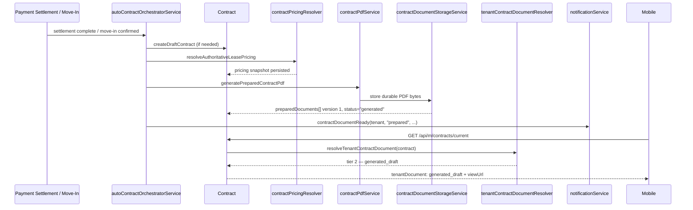
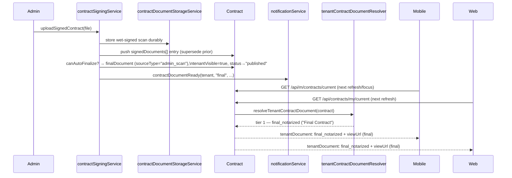

# Lilycrest Canonical Contract Web-Mobile Workflow

> Status: current as of `origin/main` @ `33c07261ac5a25ef1788a3cde98275ca7dbfb603` (PR #107) plus the two
> follow-up fixes described in §17 addendum, applied on top of that commit.
> This document supersedes `docs/MOBILE_CONTRACT_INTEGRATION_GUIDE.md` and
> `docs/CONTRACT_GENERATION_ARCHITECTURE.md` as the authoritative reference —
> those files describe an earlier, narrower or partially-stale shape of the
> workflow (see the deprecation note added to each). Do not create a second
> canonical document; update this one.

## 1. Purpose

Web (admin + tenant), the backend, and the tenant mobile app must render **one
contract lifecycle**, not three approximations of it. The backend owns every
business rule — pricing, document finality, resolver precedence — and exposes
it through a small set of endpoints. Web and mobile both consume the same
resolver output; neither is allowed to re-derive finality, recompute rent, or
invent a document label the backend didn't send.

## 2. System of Record

- **`Contract` model** (`server/models/Contract.js`) — one document per lease
  version. Key groups of fields:
  - Identity/assignment: `contractNumber`, `tenantId`, `branch`, `roomId`,
    `roomNumber`, `bedId`/`bedLabel`, `leaseStartDate`, `leaseEndDate`.
  - Pricing snapshot (frozen at generation time, never recomputed from the
    Room/Reservation after generation): `regularMonthlyRate`,
    `approvedMonthlyRate`, `discountPercentage`, `discountAmount`,
    `advanceRentAmount`, `securityDepositAmount`.
  - Lineage: `contractPurpose` (`initial` | `renewal` | `replacement`),
    `replacesContractId`, `supersededByContractId`/`supersededBy`,
    `isCurrent`, `isCanonical`.
  - Document metadata arrays/fields: `preparedDocuments[]`,
    `signedDocuments[]`, `notarizedDocuments[]`, `finalDocument`,
    `finalStorageKey`, `tenantVisible`, `publicationStatus`.
  - Lifecycle: `status` + `statusHistory[]` (see `contractService.js`'s
    `assertValidContractTransition` for the allowed state graph).
- **Reservation / Stay** — the originating booking and physical occupancy
  record. A Contract references `reservationId`; renewal/transfer flows also
  reference the prior Contract via `replacesContractId`.
- **Pricing snapshot** — produced once by `resolveAuthoritativeLeasePricing`
  (`server/services/contractPricingResolver.js`) and copied onto the Contract.
  Nothing downstream (PDF generation, admin display, mobile display) is
  allowed to recompute it independently.
- **Document metadata** — every uploaded/generated file is described by a
  sub-document with `version`, `storageProvider`, `storageKey`, `fileName`,
  `fileHash`, `fileSize`, `mimeType`, `uploadedAt`/`generatedAt`, and a
  `superseded` boolean. The file bytes are never trusted directly; every read
  goes through `contractDocumentStorageService.js`.
- **Durable storage** — `contractDocumentStorageService.js` +
  `contractPrivateStorageService.js`. See §13.

## 3. Initial Contract Lifecycle

Trigger (either one, whichever occurs — both call into
`autoContractOrchestratorService.js`):

- `autoGenerateDepositSettledContract` — fired from
  `structuredInitialPaymentService.js` the moment the Advance Rent + Security
  Deposit balance reaches zero (`remaining === 0`).
- `autoGenerateMoveInContract` — fired from
  `reservationLifecycleController.js` on Move-In.

```
Advance & Deposit fully settled  (or)  Move-In confirmed
        ↓
createDraftContract (if no current Contract exists yet for the Reservation)
        ↓
validateContractForGeneration → resolveAuthoritativeLeasePricing snapshot
copied onto the Contract, status → "ready_for_generation"
        ↓
generatePreparedContractPdf → PDF rendered, hashed, stored durably
        ↓
Contract.preparedDocuments[] gets version 1, status → "generated"
        ↓
notify.contractDocumentReady(tenantId, "prepared", contractId, version)
        ↓
Tenant/mobile can view the Generated Draft immediately
```

Answers:
- **What creates it?** A backend event (payment settlement or Move-In), not
  an admin click. `createDraftContract` (`contractService.js`) is also
  reachable by an admin manually, but the *auto* path is what fires in the
  normal product flow.
- **Automatic?** Yes.
- **Manual approval required?** No — if `validateContractForGeneration`
  passes, generation proceeds without an admin gate. If it fails (missing
  field, e.g. `tenantBirthDate`), the Contract is left as a `draft` for an
  admin to complete; no PDF is generated and no tenant notification fires.
- **When is the PDF generated?** Synchronously, in the same orchestrator call,
  immediately after validation succeeds.
- **Where is it stored?** Through `contractDocumentStorageService.js` →
  Firebase Storage in production (see §13), never left only on local disk.
- **What fields are populated?** The full pricing snapshot, template
  metadata (`templateType`, `templateVersion`, `legalContentVersion`), and
  the first `preparedDocuments[]` entry.
- **What status?** `generated`.
- **Tenant sees it immediately?** Yes — `preparedDocuments[]` version 1 is
  live the moment the transaction completes; no separate "publish the draft"
  step exists.
- **Which API exposes it?** `GET /api/contracts/my/current` (web) and
  `GET /api/m/contracts/current` (mobile) — both via
  `resolveTenantContractDocument` / `toTenantContractView`. See §9.

## 4. Renewal Contract Lifecycle

Pricing source: **`resolveAuthoritativeLeasePricing`** — the *same* resolver
used for initial Contracts. No raw client-supplied rent is ever persisted as
authoritative (fixed in commit `8a39e9b4`; previously `Stay.monthlyRent` or
a client-forwarded value could reach the successor Contract unchecked).

```
Admin/tenant selects a supported renewal duration
        ↓
GET /api/reservations/:reservationId/renewal-offer/preview?months=N
  → previewRenewalPricing (tenancyActionsController.js) calls
    resolveAuthoritativeLeasePricing read-only — no writes, no offer created
        ↓
Admin confirms → createRenewalOffer persists the SAME resolved pricing onto
  the Offer (Offer.proposedRent is now canonical-resolved, not admin-typed)
        ↓
Tenant accepts the offer
        ↓
autoGenerateRenewalContract (tenantActionService.js) →
  createSuccessorContractForRenewal (contractService.js) — prefers the
  FROZEN accepted-offer pricing over a fresh re-resolution, so a
  BusinessSettings change between offer-acceptance and Contract generation
  cannot silently alter what the tenant agreed to
        ↓
Idempotency guard: query keyed on (replacesContractId + contractPurpose:
  "renewal") — a retried/duplicate generation call reuses the existing
  successor Contract instead of creating a second one
        ↓
generatePreparedContractPdf using the successor Contract's own snapshot
        ↓
notify.contractDocumentReady(tenantId, "prepared", successorContractId, v1)
        ↓
Successor Contract visible via the same resolver as any other Contract
```

Consistency chain verified in code (`contractService.js`,
`contractRenewalActivationService.js`,
`contractService.renewalPricing.integration.test.js`):
`renewal preview approved rate == Offer.proposedRent ==
successorContract.approvedMonthlyRate == generated PDF approvedMonthlyRate`.

Activation: `contractRenewalActivationService.activateDueRenewalContracts`
transitions the successor Contract `published → active` exactly once, at its
`leaseStartDate` cutover — dedupe-keyed off the contract id alone (see
`notificationService.js` comment at the `contract_activated`-style entry),
so re-running the activation sweep cannot double-fire.

## 5. Transfer Contract Lifecycle

```
Admin approves a room transfer
        ↓
autoGenerateTransferContract (tenancyActionsController.js)
        ↓
createReplacementContractForTransfer (contractService.js) —
  resolveAuthoritativeLeasePricing re-resolved against the DESTINATION
  room's type/branch/duration, never the source room's stale rate
        ↓
Idempotency guard: (replacesContractId + contractPurpose: "replacement")
  — mirrors the renewal guard, prevents duplicate replacement Contracts
  from a retried activation call
        ↓
Old Contract: isCurrent → false, supersededByContractId set, left in place
  for history (never deleted)
        ↓
generatePreparedContractPdf for the replacement Contract
        ↓
Tenant-visible via the same canonical resolver
```

Room-transfer **billing settlement** (distinct from the Contract successor
itself) is resolved by `server/services/billing/roomTransferSettlement.js`
using **actual-days + unused-credit** (fixed in `cfca9b2e`/`b755d983`) —
structured `pricingSnapshot`, not an ad hoc proration.

## 6. Generated Contract Document

- Created the moment `generatePreparedContractPdf` succeeds (§3/§4/§5).
- Stored via `contractDocumentStorageService.js` (Firebase in production).
- Metadata lives in `Contract.preparedDocuments[]`; the *current* one is
  whichever entry has `superseded !== true`, a valid `version`, `storageKey`,
  and `fileName` — selected by
  `preparedContractDocumentService.selectCurrentPreparedDocument`, filtered
  further by `PREPARED_DOCUMENT_VISIBLE_STATUSES` (`generated` through
  `expired`; never visible while still `draft`/`incomplete`).
- **Is it tenant-visible immediately?** Yes, no separate "publish the draft"
  action exists. It is tier 2 in the resolver (§8) — visible whenever no
  `finalDocument` yet exists.
- Exposed by `resolveTenantContractDocument` as
  `{ type: "generated_draft", label: "Generated Draft — For Signing",
  isFinal: false }`, and served as bytes by
  `GET /api/contracts/my/:id/documents/prepared` (web) /
  `GET /api/m/contracts/:id/documents/prepared` (mobile) — both
  authenticated, `Cache-Control: private, no-store`.
- Durability: yes — see §13. A Render restart does not lose it.

## 7. Wet-Signed / Final Document

**Deployed behavior, verified from `contractSigningService.js` and
`contractPublicationService.js` — not the older manual pipeline:**

```
Admin uploads a wet-signed scan (PDF/JPG/PNG)
        ↓
uploadSignedContract (contractSigningService.js) —
  stores via contractDocumentStorageService, pushes a new
  signedDocuments[] entry (superseding all prior entries)
        ↓
canAutoFinalize(contract) === true whenever no finalDocument already
  exists (any status from "generated" through "expired" qualifies)
        ↓
CORE BUSINESS RULE (contractSigningService.js's own comment):
  the wet-signed upload IS the finalization event — no notarization,
  no separate "verify", no separate "mark ready", no separate "publish"
  step is required.
        ↓
contract.finalDocument = { sourceType: "admin_scan", sourceVersion,
  storageKey, fileHash, tenantVisible: true, ... }
contract.tenantVisible = true; contract.publicationStatus = "published"
status advanced straight to "published" (advanceStatusToPublished)
        ↓
notify.contractDocumentReady(tenantId, "final", contractId, version)
        ↓
Canonical resolver (§8) now returns tier 1 (final) for this Contract
        ↓
Web + Mobile both immediately reflect the wet-signed copy on next fetch —
  no additional admin action, no app update required
```

The **optional, internal** upload → verify → notarize → mark-ready → publish
pipeline (`contractNotarizationService.js` +
`contractPublicationService.publishFinalContract`) still exists and still
requires all of those manual steps — but it is an **alternate path to the
same tier-1 outcome** (`finalDocument.sourceType: "notarized"`), not the
default/required path. It matters only for admin-facing audit labeling; a
tenant/mobile viewer cannot tell which path was used except via the
`sourceType` field, and doesn't need to.

**Which document wins when both a generated draft and a wet-signed/final
copy exist?** The final document always wins — see §8. The generated draft
becomes historical the instant `finalDocument` is set; it is never deleted,
but the resolver stops returning it.

`signedDocuments[]` itself is **not** a resolver tier — it is audit/version
history. Once its current entry has been promoted into `finalDocument`, that
promoted entry cannot be replaced by another plain upload
(`FINAL_DOCUMENT_REPLACEMENT_REQUIRES_FORMAL_PROCESS`); replacing an already-
published final requires the formal process, by design (immutability once
published).

## 8. Document Resolution Priority

Implemented once, in `server/services/tenantContractDocumentResolver.js`
(`resolveTenantContractDocument`), and reused by both the web tenant API and
the mobile API through `toTenantContractView`:

| Priority | Source | Required fields | Tenant-visible? | Mobile-visible? | Label |
|---|---|---|---|---|---|
| 1 | `contract.finalDocument` (either `sourceType: "admin_scan"` or `"notarized"`) | `fileName` + (`storageKey` or `finalStorageKey`) | Yes, immediately | Yes | `"Final Notarized Contract"` if `sourceType === "notarized"`, else `"Final Contract"` |
| 2 | `contract.preparedDocuments[]`, newest non-superseded entry | `version` (integer > 0), `storageKey`, `fileName`; contract `status` in `PREPARED_DOCUMENT_VISIBLE_STATUSES` | Yes | Yes | `"Generated Draft — For Signing"` |
| 3 | none | — | No | No | `"Contract is being prepared."` |

Additional fields the resolver always returns: `available`, `type`
(`"final_notarized" | "generated_draft" | null`), `isFinal`, `version`,
`fileName`, `fileSize`, `pageCount`, `generatedAt`, `publishedAt`.

Superseded documents are explicitly filtered at tier 2
(`entry.superseded !== true`) and are structurally excluded at tier 1 (only
the single `finalDocument` object is ever considered — there is no array to
filter). `signedDocuments[]`/`notarizedDocuments[]` version history is
returned separately (§9) for admin audit and tenant transparency, but is
never itself a resolver source.

Two **historically duplicated, now-fixed** copies of this same finality rule
existed outside the canonical resolver — see the addendum in §17.

## 9. Tenant Contract API

All routes require the tenant's own session (web: `req.user`/cookie session;
mobile: `mobileTenantAuth` → `req.mobileTenant`). Every lookup is scoped to
the authenticated tenant — no client-supplied tenant id is ever trusted.

| Method | Route | Auth | Controller | Resolver/Service |
|---|---|---|---|---|
| GET | `/api/contracts/my/current` | web session | `contractController.getMyCurrentContract` | `resolveTenantCanonicalContract` + `toTenantContractView` |
| GET | `/api/contracts/my/:id/documents/prepared` | web session | `contractController` | `resolveCurrentPreparedDocument` |
| GET | `/api/contracts/my/:id/documents/final` | web session | `contractController.getFinalContractFile` | `resolvePublishedFinalDocument` |
| GET | `/api/m/contracts/current` | mobile session | `mobileContractRoutes.js` | `resolveTenantCanonicalContract({ includeEarlyStages: true })` + `toTenantContractView` |
| GET | `/api/m/contracts/:contractId/documents/prepared` | mobile session | `mobileContractRoutes.js` | `resolveCurrentPreparedDocument` |
| GET | `/api/m/contracts/:contractId/documents/final` | mobile session | `mobileContractRoutes.js` | `resolvePublishedFinalDocument` |
| GET | `/api/m/documents/contract` | mobile session | `mobileContractRoutes.js` | final if `finalDocument` exists (any `sourceType`), else prepared — **backward-compatible single-URL route, fixed in this pass (§17)** |

**One real behavioral difference, intentional:** mobile's `/contracts/current`
passes `includeEarlyStages: true` to `resolveTenantCanonicalContract`, so
mobile can show a Contract from `draft`/`incomplete` onward, while web's
tenant "My Contract" page keeps the default (early-stage-excluded) behavior.
This is documented in `mobileContractRoutes.js`'s own comment and is a
deliberate product difference, not drift — both still call the *same*
`resolveTenantCanonicalContract` function with a parameter, not a
reimplementation.

**Error states:** `404` (`CONTRACT_NOT_FOUND`, `PREPARED_DOCUMENT_UNAVAILABLE`,
`FINAL_DOCUMENT_UNAVAILABLE`), `410`
(`PREPARED_DOCUMENT_STORAGE_MISSING` — storage object missing, non-fatal,
surfaced as `preparedDocument.issue`), `401` (session expired/invalid).

### State 1 — No Contract
```json
{
  "contract": null,
  "state": "NO_PUBLISHED_CONTRACT",
  "emptyState": "Contract Not Available Yet",
  "upcoming": null
}
```

### State 2 — Generated Draft Available
```json
{
  "contract": {
    "id": "64b000000000000000000002",
    "contractId": "64b000000000000000000002",
    "contractNumber": "LIL-MNL-2026-00001",
    "status": "generated",
    "displayStatus": "Prepared Contract Available",
    "roomType": "quadruple-sharing",
    "leaseStartDate": "2026-09-01T00:00:00.000Z",
    "leaseEndDate": "2027-08-31T00:00:00.000Z",
    "leaseDurationMonths": 12,
    "approvedMonthlyRate": 4500,
    "regularMonthlyRate": 4500,
    "discountPercentage": 0,
    "advanceRentAmount": 4500,
    "securityDepositAmount": 4500,
    "tenantDocument": {
      "available": true,
      "type": "generated_draft",
      "label": "Generated Draft — For Signing",
      "isFinal": false,
      "version": 1,
      "fileName": "LIL-MNL-2026-00001_prepared_v1.pdf",
      "fileSize": 1048576,
      "pageCount": 4,
      "generatedAt": "2026-08-18T00:00:00.000Z",
      "publishedAt": null,
      "viewUrl": "/api/m/contracts/64b000000000000000000002/documents/prepared",
      "downloadUrl": "/api/m/contracts/64b000000000000000000002/documents/prepared?download=1"
    }
  },
  "state": "CONTRACT_AVAILABLE",
  "emptyState": null,
  "upcoming": null
}
```

### State 3 — Wet-Signed/Final Available
Only `tenantDocument` (and `status`/`displayStatus`) differ from State 2:
```json
{
  "tenantDocument": {
    "available": true,
    "type": "final_notarized",
    "label": "Final Contract",
    "isFinal": true,
    "version": 1,
    "fileName": "LIL-MNL-2026-00001_signed_v1.pdf",
    "fileSize": 2097152,
    "pageCount": 4,
    "generatedAt": "2026-08-19T02:00:00.000Z",
    "publishedAt": "2026-08-19T02:00:00.000Z",
    "viewUrl": "/api/m/contracts/64b000000000000000000002/documents/final",
    "downloadUrl": "/api/m/contracts/64b000000000000000000002/documents/final?download=1"
  }
}
```
Note: `label` is `"Final Notarized Contract"` only when the underlying
`finalDocument.sourceType === "notarized"`; the default wet-signed
(`admin_scan`) path labels it `"Final Contract"`.

There is also a legacy, **non-canonical**, response field named
`finalDocument` on the same payload (distinct from
`tenantDocument`/`preparedDocument`) kept for backward API compatibility.
**Mobile must not read it for availability or URLs** — use `tenantDocument`
exclusively. See §17 addendum for why.

### State 4 — Historical/Superseded Contract
Mobile/web `current` endpoints never return a superseded/replaced Contract —
`resolveTenantCanonicalContract` selects only the current one
(`isCurrent: true`). A tenant mid-renewal *does* receive the **next**
Contract separately via the `upcoming` field (from
`resolveTenantUpcomingContract`) when one exists — same shape as `contract`,
not a superseded/historical one. Fully historical Contracts (old, replaced
versions) are intentionally not exposed through this endpoint at all; they
exist only for admin audit (`contractArchiveService.js`,
`ContractDetailDrawer.jsx`'s history section).

## 10. Mobile Rendering Rules

| Backend state | Mobile display |
|---|---|
| `contract === null` / `state: "NO_PUBLISHED_CONTRACT"` | Empty state: "Contract Not Available Yet" |
| Contract exists, `tenantDocument.available === false` | "Contract is being prepared." — **only** while genuinely no document exists yet; never a permanent state once `preparedDocuments[]` has an entry |
| `tenantDocument.type === "generated_draft"` | Show "Generated Draft — For Signing" card, View/Download enabled |
| `tenantDocument.type === "final_notarized"` | Show final/signed card (label from `tenantDocument.label`), View/Download enabled |
| Superseded prepared version, or old signedDocuments[] entry | Never shown as current — resolver already excludes it |

## 11. Refresh Rules

The resolver is stateless and cheap (no PDF I/O until a document is actually
streamed), so mobile should refetch `GET /api/m/contracts/current` on:
- screen focus,
- pull-to-refresh,
- push-notification tap (the `contract_document_ready` payload — see §12 —
  carries `contract_id`/`screen: "contract"` for direct navigation),
- app foreground,
- successful login/session restore.

No mobile-side caching of "is this final" is needed or correct — the backend
is cheap enough to re-ask every time, and caching that boolean is exactly the
kind of local-lifecycle-reconstruction this document prohibits (§17).

## 12. Notification Flow

Tenant-facing, push-capable, all through
`notify.contractDocumentReady(userId, variant, contractId, version)`
(`server/services/notifications/notificationService.js`):

| Event | Variant | Fired from |
|---|---|---|
| Initial/renewal/transfer Contract auto-generated | `"prepared"` | `autoContractOrchestratorService.js` (all four `autoGenerate*Contract` functions), `contractController.js:1058` (manual admin generate/regenerate) |
| Wet-signed upload auto-finalizes the Contract | `"final"` | `contractController.js:497` (the primary, canonical upload path) |
| One-step notarized upload-and-finalize | `"final"` | `contractController.js:643` |
| Formal `publishFinalContract` (notarized pipeline) | `"final"` | `contractController.js:782` |

Every call is **dedupe-keyed** on
`` `contract_document_ready:{contractId}:{variant}:{version}` `` — a retried
generation or a resend cannot create a duplicate notification for the same
document version. `entityType: "contract"`, `entityId: contractId`,
`actionUrl: "/tenant/documents"` (in-app), and the push payload carries
`contract_id`, `screen: "contract"`, `url: "/contract-viewer"` — all
mobile-navigable identifiers, no legacy/ambiguous field. All notification
sends are wrapped `.catch()`-non-fatal — a failed push never rolls back the
already-committed Contract state.

Renewal activation (`published → active` at `leaseStartDate` cutover) fires
its own separately dedupe-keyed notification (contract-id-only key, since
activation happens exactly once per contract) — see the comment block in
`notificationService.js` immediately following `contractDocumentReady`.

## 13. Storage Architecture

`contractDocumentStorageService.js`'s `useLocalStorage()`:
```js
const useLocalStorage = () => {
  if (process.env.NODE_ENV === "production") return false;
  return process.env.CONTRACT_DOCUMENT_STORAGE === "local"
    || process.env.NODE_ENV === "test"
    || !admin.apps.length;
};
```
**In production this is unconditionally `false`** — every prepared, signed,
and notarized document is written to Firebase Storage, never left only on
Render's container filesystem. This was specifically hardened in commit
`c613ec70` ("move signed and notarized files to durable storage") precisely
because Render's free-tier containers have no persistent disk: anything
written only to `server/private/*` (a `.gitignore`d, non-persistent path)
silently disappears on restart/redeploy, while the Mongo metadata pointing at
it would survive — producing a "document exists in the database but 404s on
open" failure mode. Every document record carries its own `storageProvider`
tag, so a legacy local-only record (pre-migration) is never searched for in
Firebase, and a Firebase record is never assumed local — resolution is
provider-aware per-document, not NODE_ENV-based at read time.

Local disk (`server/private/...`) is used only in development/test, or if
`CONTRACT_DOCUMENT_STORAGE=local` is explicitly set outside production.

## 14. Error Handling

- **Generated PDF failure**: `generatePreparedContractPdf` throwing leaves
  the Contract at `ready_for_generation` (or its prior status) with **no**
  new `preparedDocuments[]` entry — the resolver correctly falls through to
  tier 3 ("being prepared"), never a fake tier-2 result. Retrying calls the
  same generation path again; no duplicate Contract is created because the
  Contract itself already exists (`Contract.findOne({ reservationId,
  isCurrent: true })` in the orchestrator) — only the PDF generation step is
  retried.
- **Wet-signed upload failure**: `uploadSignedContract` wraps the storage
  write and the `contract.save()` in a try/catch that calls
  `removeSignedContractDocument` (rollback of the just-uploaded object) and
  rethrows on any save error — no half-published `finalDocument`, no Mongo
  record pointing at a non-existent storage object. The previously-current
  document (prior signed entry or the generated draft) remains resolvable
  throughout.
- **Duplicate upload**: every `uploadSignedContract` call supersedes all
  prior `signedDocuments[]` entries (`document.superseded = true`) before
  pushing the new one; `selectCurrentPreparedDocument`/the tier-1 resolver
  branch only ever consider the current (non-superseded) entry. Historical
  versions remain in the array for internal audit but are excluded from
  every tenant-facing resolution path.
- **Deleted/superseded document**: `deleteSignedContract` explicitly refuses
  to delete the entry a published `finalDocument` points at
  (`FINAL_DOCUMENT_REPLACEMENT_REQUIRES_FORMAL_PROCESS`); a non-final
  deleted version promotes the next remaining entry to current. The resolver
  never returns a `superseded`/deleted/missing document by construction — it
  filters before selecting, not after.
- **Render restart**: durable (Firebase) storage plus Mongo metadata both
  persist independently of the Node process — a restart changes nothing
  about document resolvability (see §13).

## 15. Source Files

| Concern | File |
|---|---|
| Canonical document resolver | `server/services/tenantContractDocumentResolver.js` |
| Prepared-document selection | `server/services/preparedContractDocumentService.js` |
| Final-document resolution (both `sourceType`s) | `server/services/contractPublicationService.js` |
| Wet-signed upload / auto-finalize | `server/services/contractSigningService.js` |
| Optional notarization pipeline | `server/services/contractNotarizationService.js` |
| Durable storage (Firebase/local) | `server/services/contractDocumentStorageService.js`, `contractPrivateStorageService.js` |
| Pricing resolver | `server/services/contractPricingResolver.js` |
| Generation orchestration (initial/renewal/transfer) | `server/services/autoContractOrchestratorService.js` |
| Contract state machine, successor/replacement creation | `server/services/contractService.js` |
| Renewal cutover/activation | `server/services/contractRenewalActivationService.js` |
| Transfer cutover/activation | `server/services/contractRoomTransferActivationService.js` |
| Room-transfer billing settlement | `server/services/billing/roomTransferSettlement.js` |
| Shared tenant view shape | `server/services/tenantContractViewService.js` |
| Tenant Contract selection (current/upcoming/history) | `server/services/tenantContractSelectionService.js` |
| Web tenant API | `server/controllers/contractController.js` |
| Web admin API + drawer | `server/controllers/contractController.js`, `web/src/features/admin/components/contracts/ContractDetailDrawer.jsx` |
| Mobile Contract API | `server/routes/mobileContractRoutes.js` |
| Notifications | `server/services/notifications/notificationService.js` |
| PDF rendering | `server/services/contractPdfService.js`, `contractGenerationDataService.js` |

## 16. Sequence Diagrams

### Generated Draft



### Wet-Signed Replacement



## 17. Mobile Implementation Contract

### Do
- Fetch `GET /api/m/contracts/current` as the single source of truth.
- Render based on `contract.tenantDocument` — `available`, `type`, `label`,
  `isFinal`, `version`, `viewUrl`, `downloadUrl`.
- Use the backend-provided `viewUrl`/`downloadUrl` (relative to the API base)
  for the protected document routes — both require the mobile session
  bearer token.
- Refresh contract state on screen focus, pull-to-refresh, push-notification
  tap, app foreground, and login/session restore (§11).
- Replace the generated-draft presentation the moment
  `tenantDocument.type === "final_notarized"` is returned — same Contract ID,
  no new Contract, no app update needed.
- Preserve/display historical documents **only** if a future backend change
  intentionally exposes a history endpoint — today, `current` never returns
  superseded documents, and mobile should not go looking for them elsewhere.

### Do Not
- Recalculate rent, discount, or advance/deposit amounts — every pricing
  field on the Contract is already the authoritative, resolver-produced
  value.
- Reconstruct the contract lifecycle locally (e.g. inferring "final" from a
  filename, a status string pattern, or the presence of `signedDocuments[]`).
- Decide finality based on `notarizationVerifiedAt` or any notarization
  field — the default, product-standard finalization path
  (`sourceType: "admin_scan"`) never sets it. Finality is
  `tenantDocument.isFinal` / `tenantDocument.type === "final_notarized"`,
  full stop.
- Require notarization before showing a document as final unless the backend
  API response says so.
- Directly read Firebase/Render/local storage paths (`storageKey`) from any
  metadata — always go through the provided `viewUrl`/`downloadUrl`.
- Hardcode room rates or duration options — ask `resolveAuthoritativeLeasePricing`-
  backed endpoints (the renewal preview endpoint, or the Contract's own
  persisted pricing fields).
- Keep showing "Processing"/"being prepared" once
  `tenantDocument.available === true`.
- Read the legacy `finalDocument` field in the `/current` response body for
  availability or URLs — use `tenantDocument` (see §17 addendum below for why
  that legacy field cannot be trusted as-is).
- Assume `finalDocument` (tier 1) is the only valid tenant document — a
  `generated_draft` (tier 2) is a fully legitimate, fully tenant-visible
  state before finalization; do not treat its absence of a "final" label as
  an error state.

### Addendum — defects found and fixed in this pass

Two call sites outside the canonical resolver had independently reimplemented
the finality check, both requiring `contract.notarizationVerifiedAt` — a
field the default/standard wet-signed (`admin_scan`) finalization path never
sets (only the optional internal notarized pipeline sets it). Both were
proven, by reading `contractSigningService.js`'s actual write path, to
silently keep serving/reporting the generated draft as current even after an
admin's wet-signed upload had already finalized the Contract:

1. `server/routes/mobileContractRoutes.js`'s legacy
   `GET /api/m/documents/contract` route — gated final-document streaming on
   `Boolean(contract.notarizationVerifiedAt)`. **Fixed**: gate on
   `contract.finalDocument` presence only, letting
   `resolvePublishedFinalDocument`'s own `sourceType` branch (which already
   handled `admin_scan` correctly) decide.
2. `server/services/tenantContractViewService.js`'s `finalDocument.available`
   computation (a legacy, non-canonical field on the shared tenant/mobile
   `/current` response, separate from the correct `tenantDocument` field) —
   same `notarizationVerifiedAt` requirement, so it reported
   `available: false` for every wet-signed-finalized Contract. **Fixed**:
   dropped the `notarizationVerifiedAt` condition, kept the `status`/
   `tenantVisible` defense-in-depth checks intact.

Both fixes are covered by new regression tests
(`tenantContractViewService.test.js`, `mobileContractRoutes.behavior.test.js`)
and the full affected suite (`contract|mobile` pattern: 973/973,
full `npm run test:ci`: 2229/2229) passes with them applied. Web was not
practically broken by either defect — `ContractsPage.jsx` already falls back
to `tenantDocument.isFinal` and fetches final bytes through its own API
client method rather than the payload's `finalDocument.viewUrl` — but mobile
had no such workaround, and the legacy field is documented here as
off-limits precisely so a similar workaround is never needed again.
