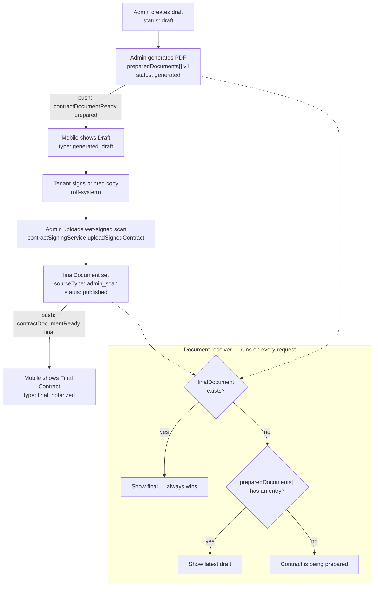

# Contract Workflow Process — Draft & Wet-Signed Display on Mobile

**Purpose:** a single, end-to-end process document for how a tenant's contract moves from
creation to final signed document, and exactly how the system guarantees mobile always shows
the *correct* document (draft or wet-signed) with no conflicting or duplicate views.

This is the process-level companion to the field-level API spec in
[`MOBILE_CONTRACT_INTEGRATION_GUIDE.md`](./MOBILE_CONTRACT_INTEGRATION_GUIDE.md) and the
code-level audit in [`CONTRACT_SUPPORT_COMMUNICATION_PROCESS.md`](./CONTRACT_SUPPORT_COMMUNICATION_PROCESS.md).
Read this one first if you need "what happens, in what order, and why it can't conflict."
Read the integration guide if you need exact request/response shapes.

---

## 1. The two kinds of "conflict" this process prevents

There are two, easily confused, failure modes. The system uses a **different resolver for
each one**, and mobile must never try to solve either by inspecting raw fields itself.

| Conflict type | Question it answers | Resolver | Where |
|---|---|---|---|
| **Document-level** | "This one Contract record has a draft *and* a wet-signed scan — which PDF does the tenant see?" | `resolveTenantContractDocument()` | `server/services/tenantContractDocumentResolver.js` |
| **Record-level** | "This tenant has more than one Contract record that looks current — which one is real?" | `selectCanonicalTenantContract()` | `server/services/tenantContractSelectionService.js` |

Both resolvers run **server-side**, on every request. Mobile never picks between two documents
or two records — it renders whatever the resolver already decided.

---

## 2. Step-by-step workflow

```
STEP 1 — Draft created
  Actor: Admin (manual) or system (auto, on deposit settlement / move-in)
  Action: POST /api/contracts  →  contractService.createDraftContract
  Result: Contract row exists, status = "draft", no PDF yet
  Mobile: GET /api/m/contracts/current → tenantDocument.available = false
          → "Contract is being prepared."

STEP 2 — Draft PDF generated
  Actor: Admin clicks "Generate", or autoContractOrchestratorService
  Action: POST /api/contracts/:id/generate → contractPdfService
  Result: preparedDocuments[] gets a new versioned entry, status = "generated"
  Mobile: tenantDocument.type = "generated_draft"
          label = "Generated Draft — For Signing"
          viewUrl → /api/m/contracts/:id/documents/prepared
  Push:   notify.contractDocumentReady(..., variant: "prepared")
          → "Contract Ready for Signing"

STEP 3 — Tenant reviews & physically signs the printed draft
  Actor: Tenant (off-system, in person)
  Result: no state change yet — mobile keeps showing the draft

STEP 4 — Admin uploads the wet-signed scan
  Actor: Admin, from the printed & signed copy
  Action: POST /api/contracts/:id/documents/signed (PDF/JPG/JPEG/PNG, ≤10MB)
  Handler: contractSigningService.uploadSignedContract
  CORE RULE: for the standard path, this upload IS the finalization event.
             There is no separate "verify" or "publish" click required.
  Result: contract.finalDocument is set
            sourceType: "admin_scan"
            tenantVisible: true
            publicationStatus: "published"
          status advances to "published" (contractService state machine)
  Mobile: tenantDocument.type flips to "final_notarized"
          label = "Final Contract"
          viewUrl → /api/m/contracts/:id/documents/final
          (the /documents/prepared URL from Step 2 is no longer the one to show)
  Push:   notify.contractDocumentReady(..., variant: "final")
          → "Final Contract Ready"

STEP 5 — Mobile displays the correct state, always
  On every fetch of GET /api/m/contracts/current, the backend already resolved
  which single document to show (§3). Mobile does not choose between draft and
  final — it renders tenantDocument.type as given.
```

An **optional internal notarization pipeline** exists as an alternate route to Step 4
(`sourceType: "notarized"` instead of `"admin_scan"`, via `notarizedDocuments[]` and a
4-step verify → ready-for-publication → publish flow, or the newer 1-step
`uploadAndFinalizeNotarizedContract`). Mobile treats both source types identically —
same `type: "final_notarized"`, same `isFinal: true`; only the display `label` text differs
("Final Contract" vs "Final Notarized Contract").

---

## 3. Why the document-level conflict can't happen

`tenantContractDocumentResolver.js` applies a strict, three-tier priority — never a merge,
never "most recent wins" by timestamp:

1. **`contract.finalDocument` exists** → always shown, unconditionally, regardless of
   `status` or whether older `preparedDocuments[]` entries still exist. This is why a tenant
   who has *both* a generated draft and an uploaded wet-signed scan on the same Contract
   record never sees the draft again — the final document always wins.
2. **Else, the latest non-superseded entry in `preparedDocuments[]`** → shown as the draft.
3. **Else** → `available: false`, "Contract is being prepared."

Mobile is handed the outcome pre-computed as `tenantDocument` (`available`, `type`, `label`,
`isFinal`, `viewUrl`, `downloadUrl`). It must **never** re-derive this from `status`,
`notarizationVerifiedAt`, or by inspecting `finalDocument`/`signedDocuments` directly — two
backend call sites did exactly that historically and got it wrong (fixed in PR #110); mobile
should not repeat the mistake. See §7 of the integration guide for the explicit "don'ts."

---

## 4. Why the record-level conflict can't happen (silently)

A tenant can, in real operational scenarios, end up with more than one Contract record that
looks "current" — e.g. a stale early-stage draft left behind when a new contract was
generated for the same stay, or a genuine duplicate. `selectCanonicalTenantContract()`
resolves this by ranking every candidate contract on:

1. **Relationship rank** — match to the tenant's active Stay beats a match by
   `reservationId` beats a match by `applicationId`.
2. **Stage tier** — any contract that has progressed past the early stages
   (`generated` and beyond) always outranks a stale `draft`/`incomplete`/
   `ready_for_generation` record for the same stay, even if the draft is technically newer.

If two candidates still tie after both checks, the resolver does **not** guess — it throws
`MULTIPLE_CANONICAL_CONTRACTS` (HTTP 409). On web, `TenantDetailModal.jsx` surfaces this as an
explicit banner ("Multiple active contract records were found... resolve the conflicting
contract records before downloading/viewing") rather than silently showing the wrong one.
This is what commit `dbc63a57` ("use canonical contract selection in tenant details") wired up —
before it, the web admin picked its "current" contract via three separate ad-hoc client-side
heuristics that could silently surface a wrong historical/archived contract.

`server/scripts/audit_duplicate_contracts.mjs` runs (dry-run only) to detect this scenario
proactively across the whole tenant base, and `contractArchiveService.js` cascade-archives
stale early-stage drafts once a real contract exists for the same stay, so the tie condition
is kept rare in practice rather than relied upon as the only safeguard.

---

## 5. Mobile-side responsibilities (summary)

| Do | Don't |
|---|---|
| Read `tenantDocument.available` / `.type` / `.isFinal` to decide what to render | Infer draft-vs-final from `status`, `notarizationVerifiedAt`, or `finalDocument` fields directly |
| Refetch `/api/m/contracts/current` on push notification tap, app foreground, and pull-to-refresh | Cache `viewUrl`/`downloadUrl` indefinitely — the path changes from `/documents/prepared` to `/documents/final` on finalization |
| Treat `admin_scan` and `notarized` final contracts identically (`type: "final_notarized"`) | Build a separate "is this notarized" UI check |
| Treat a `409 MULTIPLE_CANONICAL_CONTRACTS` response as a real error state ("contact support") | Pick one of multiple candidate contracts client-side |
| Treat an upload of the wet-signed scan as immediately final (no "publish" step to wait for) | Show a "pending admin publish" state after a wet-signed upload — for the standard path, none exists |

---

## 6. Known gap to be aware of (as of the 2026-08-19 audit)

The **1-step finalize path** (`contractNotarizationService.uploadAndFinalizeNotarizedContract`,
used by the newer "Upload Final Contract" admin action) sets `finalDocument` correctly but
currently **does not call `notify.contractDocumentReady()`** — so mobile will show the final
contract correctly once it refetches, but the push notification that would normally prompt
that refetch may not fire on this particular path. The older 4-step
`contractPublicationService.publishFinalContract` path does fire the notification correctly.
Until this is fixed backend-side, mobile's foreground/pull-to-refresh refetch triggers (§4C of
the integration guide) are the reliable fallback — don't rely on push alone for this one path.
See `docs/CONTRACT_SUPPORT_COMMUNICATION_PROCESS.md` §C/§J for the full audit detail.

---

## 7. Visual summary


