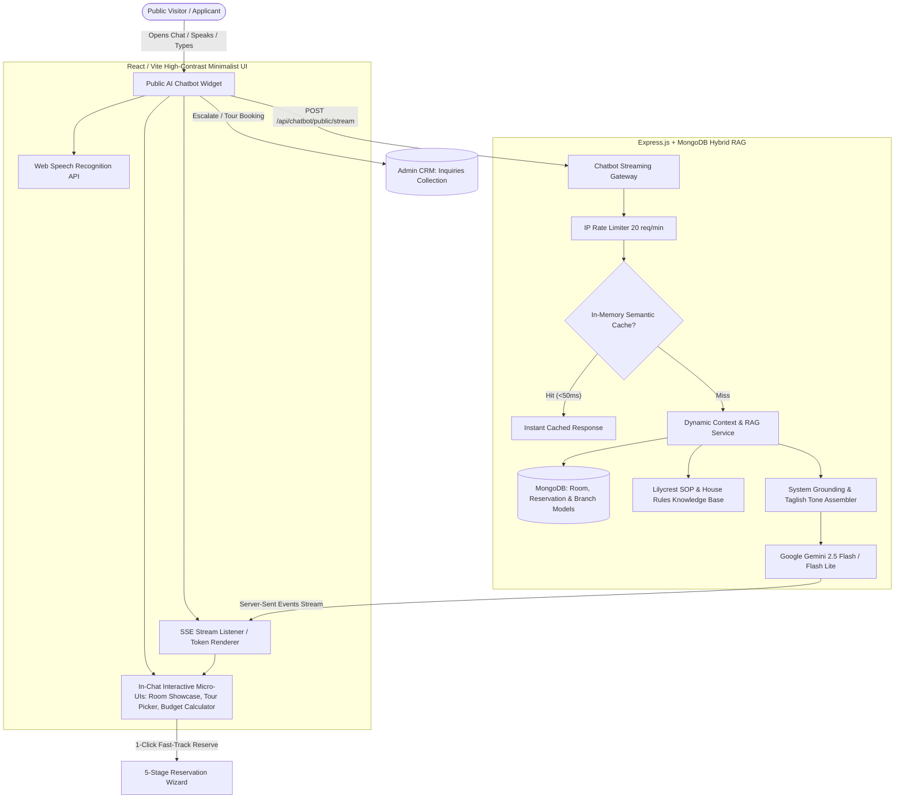

# Lilycrest DMS — Phase 1: Public Visitor & Applicant AI Chatbot Architecture Specification (Pro Max Edition)

## 1. Executive Summary & Objectives

The **Public Visitor & Applicant AI Chatbot (Pro Max)** is the flagship digital front-desk receptionist for the Lilycrest Dormitory Management System (Lilycrest DMS). Embedded seamlessly across all public touchpoints (Landing Page, Room Availability, and Reservation Flow), it delivers an intelligent, conversational admissions experience that answers questions with **real-time database grounding**, provides **interactive in-chat micro-UIs**, understands natural **Taglish / Filipino hospitality**, and accelerates prospective tenant conversion through **conversational pre-application**.



### Key Architectural Objectives
1. **Real-Time Live Inventory Grounding**: Move beyond static text by dynamically querying active MongoDB room and bed availability (`Room`, `Reservation`) in real time (< 1.2s).
2. **Sub-300ms Perceived Latency (SSE Streaming)**: Utilize Server-Sent Events (SSE) for word-by-word streaming, drastically reducing Time-To-First-Token (TTFT).
3. **Interactive In-Chat Micro-UIs**: Render interactive Room Showcase cards, Viewing Tour date-pickers, and Budget/Utility calculators directly inside the chat bubbles.
4. **Natural Taglish & Hospitality NLU**: Comprehend and respond politely in English, Filipino, or Taglish with authentic Filipino hospitality (*po/opo*, warm, professional tone).
5. **Conversational Pre-Application & Fast-Track Onboarding**: Guide applicants conversationally and pre-populate the 5-step registration wizard.
6. **Zero AI Hallucinations & Enterprise Safety**: Strict system grounding rules preventing fabricated rates, unapproved discounts, or conflicting house policies.
7. **Automated CRM Lead Scoring & Prioritization**: Automatically categorize inquiries (*High-Intent / Immediate Move-In*, *Viewing Scheduled*, *General FAQ*) in the Admin Pipeline.

---

## 2. Target Personas & Real-World User Scenarios

### Persona 1: University Student / First-Time Dormer
* **Demographics**: 18–22 y/o college student looking for an affordable bedspace near Arellano, DLSU, or Makati universities.
* **Key Needs**: Quadruple room pricing, study lounge access, curfew flexibility, security, and Wi-Fi speed.
* **Sample Interaction (Taglish)**:
  * *User*: *"Hello po! Magkano po quadruple sharing sa Gil Puyat branch? Kasama na po ba kuryente at tubig?"*
  * *AI Chatbot*: *"Hello! Sa aming **Gil Puyat Branch (Pasay)**, ang Quadruple Sharing Room ay nagsisimula sa **₱3,500 – ₱4,200/buwan** bawat tao. Kasama na po rito ang high-speed Wi-Fi, air-conditioning, at free water! Ang kuryente naman po ay hinahati nang pantay-pantay (pro-rata) sa bawat kwarto tuwing ika-15 ng buwan. Gusto niyo po bang makita ang mga bakanteng slots?"* `[Renders Live Room Showcase Card]`

### Persona 2: Working Professional / Night-Shift BPO Employee
* **Demographics**: 23–35 y/o working in BGC, Pasay, or Makati CBD with graveyard work schedules.
* **Key Needs**: Guadalupe location proximity (MRT-3/BGC Bus), night-shift curfew clearance, private or double rooms.
* **Sample Interaction**:
  * *User*: *"I work night shifts in BGC. Can I enter the Guadalupe dorm at 3:00 AM? Do you have single rooms?"*
  * *AI Chatbot*: *"Yes! While our main gate is secured from 11:00 PM to 5:00 AM, night-shift tenants have 24/7 late entry privileges with a registered company ID. At our **Guadalupe Branch**, we currently have **Private Single Rooms** starting at **₱9,000/month** (only 1 bed slot remaining on Floor 3). Would you like to schedule an in-person viewing?"* `[Renders In-Chat Viewing Booking Form]`

### Persona 3: Budget-Conscious Applicant
* **Demographics**: Applicant with a fixed monthly accommodation budget wanting clear utility projections.
* **Key Needs**: Total estimated monthly outflow (Rent + Appliance Surcharges + Estimated Electricity).
* **Sample Interaction**:
  * *User*: *"My monthly budget is ₱6,000 all-in. What room can I get with my laptop and mini-fridge?"*
  * *AI Chatbot*: `[Renders Interactive Budget Estimator Widget with ₱5,500 Double Sharing + ₱200 Mini-ref + ₱300 Electricity Share = ₱6,000 Est. Total]`

---

## 3. Dynamic Live Grounding & Hybrid RAG Architecture

Rather than relying on static prompt text, the backend incorporates a **Hybrid RAG Service** (`server/services/chatbot/liveGroundingService.js`) that injects real-time operational context:

```javascript
// Dynamic snapshot injected into Gemini Prompt at query execution
export async function buildLiveChatbotContext(branchQuery = null) {
  const [branchInventory, pricingConfig, housePolicies] = await Promise.all([
    // Real-time bed availability query across branches
    Room.aggregate([
      { $match: { isArchived: false, ...(branchQuery ? { branch: branchQuery } : {}) } },
      {
        $group: {
          _id: { branch: "$branch", type: "$type" },
          totalRooms: { $sum: 1 },
          totalCapacity: { $sum: "$capacity" },
          availableBeds: { $sum: "$availableBeds" },
          minPrice: { $min: "$basePrice" },
          maxPrice: { $max: "$basePrice" }
        }
      }
    ]),
    fetchActiveBranchPricing(),
    fetchCuratedSopPolicies()
  ]);

  return formatGroundingPrompt(branchInventory, pricingConfig, housePolicies);
}
```

### Knowledge Base Composition:
1. **Dynamic Room Inventory**: Active available bed counts, floor numbers, room types, and current prices.
2. **Branch Profiles & Transit**:
   * *Gil Puyat Branch*: Taft Ave / Buendia, Pasay City (near LRT-1 Gil Puyat, Arellano University, DLTB/JAM Bus Terminal).
   * *Guadalupe Branch*: EDSA Guadalupe Nuevo, Makati City (near MRT-3 Guadalupe, Guadalupe Mall, BGC Bus Terminal).
3. **House Policies & Standard Operating Procedures (SOP)**:
   * *Curfew*: 11:00 PM – 5:00 AM (waiver / 24-hr access for verified night-shift workers).
   * *Visitors*: 8:00 AM – 8:00 PM in common lounges (no overnight guests in dorm rooms).
   * *Utilities*: Water included in base rent; Room Electricity metered per room and calculated on a monthly pro-rata shared consumption formula every 15th.
   * *Appliance Registry*: Laptops/phones free; Mini-fridges (₱200/mo), Rice Cookers (₱150/mo), Electric Fans (₱100/mo).
   * *KYC ID Requirements*: Passport, UMID, Driver's License, PhilSys National ID, Postal ID, PRC ID, or Valid Student ID (with Certificate of Registration).

---

## 4. UI/UX Component Architecture (React / Vite)

Following the Lilycrest design standards: **Solid HSL tokens, 1px crisp borders, strictly no gradients, high-contrast typography, and accessible keyboard ergonomics**.

### Component Hierarchy
```
web/src/features/public/components/chatbot/
├── PublicChatbotLauncher.jsx         # Floating launcher with unread badge & pulse indicator
├── PublicChatbotModal.jsx            # 380px x 560px modal / Full-screen mobile overlay
├── ChatHeader.jsx                    # Branch selector, clear chat, live status, minimize/close
├── ChatMessageList.jsx               # Scrollable message container with auto-anchor
├── ChatMessageBubble.jsx             # Speech bubble supporting markdown + interactive cards
├── ChatInputBar.jsx                  # Single-line input, voice mic button, send CTA
├── ChatTypingIndicator.jsx           # Clean 3-dot pulse animation
├── ChatQuickPrompts.jsx              # One-tap categorized suggestion pills
│
├── widgets/                          # In-Chat Interactive Micro-UIs
│   ├── ChatRoomShowcaseCard.jsx      # Live room preview with photo, price, & 1-click Reserve
│   ├── ChatViewingBookingCard.jsx    # Date/time tour scheduler directly in chat
│   ├── ChatBudgetEstimatorWidget.jsx # Interactive rent + utility slider calculator
│   └── ChatKycChecklistWidget.jsx    # Interactive checklist for accepted IDs & documents
│
└── forms/
    └── ChatLeadEscalationForm.jsx    # High-contrast contact & viewing capture form
```

### In-Chat Micro-UI Specifications:

#### A. Interactive Room Showcase Card (`ChatRoomShowcaseCard.jsx`)
* Solid container: `background: var(--card)`, `border: 1px solid var(--border)`, `border-radius: var(--radius-md)`.
* Elements: Room Type badge, Branch pin (`Gil Puyat` / `Guadalupe`), Price tag (`₱3,500/mo`), Live Availability tag (`● 3 beds open`), and CTA Button (`"Reserve Now"` ➔ navigates to `/applicant/check-availability?roomType=...`).

#### B. In-Chat Viewing Booking Card (`ChatViewingBookingCard.jsx`)
* Allows the user to select:
  1. *Branch*: Gil Puyat / Guadalupe
  2. *Preferred Tour Date*: HTML5 Date Picker (`min: tomorrow`)
  3. *Time Slot*: 10:00 AM / 2:00 PM / 4:00 PM / 6:00 PM
* Submitting immediately creates a scheduled viewing lead in the Admin Inquiries collection.

#### C. Budget & Utility Calculator Widget (`ChatBudgetEstimatorWidget.jsx`)
* Interactive budget slider from ₱3,000 to ₱15,000.
* Instant visual breakdown:
  * **Base Rent**: ₱3,500.00
  * **Estimated Electricity (Pro-rata)**: ~₱650.00
  * **Water & Wi-Fi**: ₱0.00 (Included)
  * **Total Estimated Monthly Outflow**: ₱4,150.00

#### D. Voice Recognition Module (`ChatVoiceInputButton.jsx`)
* Uses native browser `webkitSpeechRecognition` / `SpeechRecognition` API.
* Provides real-time visual pulse while recording; automatically populates text input and triggers conversational query on pause.

---

## 5. Backend Architecture & API Contracts

### Endpoints Specification

#### 1. Public Conversational Query (JSON Fallback)
* **Route**: `POST /api/chatbot/public/query`
* **Rate Limit**: 20 requests / min per IP
* **Request Body**:
```json
{
  "message": "Do you have available quadruple rooms in Guadalupe?",
  "branchFocus": "guadalupe",
  "conversationHistory": [
    { "role": "user", "text": "Hi" },
    { "role": "assistant", "text": "Hello! Welcome to Lilycrest DMS. How can I assist you today?" }
  ]
}
```
* **Response Payload**:
```json
{
  "success": true,
  "data": {
    "reply": "Yes! We currently have **4 available beds** in our Quadruple Sharing Rooms at the **Guadalupe Branch** starting at **₱3,500/month** per person.",
    "richWidgets": [
      {
        "type": "room_showcase",
        "data": {
          "branch": "Guadalupe",
          "roomType": "Quadruple Sharing",
          "basePrice": 3500,
          "availableBeds": 4,
          "features": ["Air-Conditioned", "Study Desk", "En-suite Bath", "Free Wi-Fi"],
          "actionUrl": "/applicant/check-availability?branch=Guadalupe&roomType=Quadruple"
        }
      }
    ],
    "suggestedActions": [
      { "label": "Schedule a Visit", "action": "open_viewing_widget" },
      { "label": "Calculate Monthly Budget", "action": "open_budget_widget" }
    ],
    "canEscalate": true
  }
}
```

#### 2. Public Conversational Token Stream (Server-Sent Events)
* **Route**: `POST /api/chatbot/public/stream`
* **Headers**: `Accept: text/event-stream`
* **Stream Events**:
  * `event: token` ➔ `{ "token": "At our " }`
  * `event: widget` ➔ `{ "type": "room_showcase", "data": { ... } }`
  * `event: actions` ➔ `{ "actions": [ ... ] }`
  * `event: done` ➔ `{ "done": true }`

#### 3. Lead Escalation & Direct Viewing Scheduler
* **Route**: `POST /api/chatbot/public/lead-escalation`
* **Request Body**:
```json
{
  "name": "Juan Dela Cruz",
  "email": "juan.delacruz@gmail.com",
  "phone": "09171234567",
  "preferredBranch": "guadalupe",
  "preferredRoomType": "quadruple_sharing",
  "scheduledViewingDate": "2026-08-20",
  "scheduledViewingTimeSlot": "14:00",
  "message": "Inquiring for college dorm stay starting September.",
  "intentCategory": "viewing_request",
  "leadPriority": "high"
}
```
* **Response Payload**:
```json
{
  "success": true,
  "data": {
    "inquiryId": "66bc891f0923ef12019488a1",
    "viewingScheduled": true,
    "message": "Your viewing appointment for Guadalupe Branch on August 20 at 2:00 PM has been confirmed. A confirmation SMS/Email has been sent."
  }
}
```

---

## 6. AI Prompt Engineering & Grounding Rules (Gemini 2.5 Flash)

```typescript
const SYSTEM_PROMPT = `
You are "Lily", the official AI Admissions Receptionist for Lilycrest Dormitory Management System (Lilycrest DMS).
Your mission is to provide warm, courteous, highly precise, and professional assistance to prospective tenants, applicants, and parents.

CORE PERSONALITY & TONE GUIDELINES:
1. Warm Filipino Hospitality: Greet users cordially. If the user writes in Tagalog or Taglish, respond naturally in polite Taglish/Filipino using appropriate honorifics (po/opo).
2. Professional & Concise: Keep answers under 3-4 sentences per thought. Never overwhelm the user with walls of text.
3. Currency Standard: Format all currency in Philippine Peso (PHP / ₱).

STRICT GROUNDING & ANTI-HALLUCINATION RULES:
1. Use ONLY the facts provided in the LIVE DORMITORY CONTEXT below.
2. NEVER invent room rates, unauthorized discounts, promotional perks, or fake room numbers.
3. If a question is outside the provided context, politely apologize and suggest scheduling a staff callback or viewing.
4. Always distinguish between our two branches: "Gil Puyat Branch" (Pasay City) and "Guadalupe Branch" (Makati City).

LIVE DORMITORY INVENTORY & POLICIES CONTEXT:
${liveDormitoryContextSnapshot}
`;
```

---

## 7. Quality, Verification & Safety Gates

1. **Anti-Hallucination Gate**: Verify 0% hallucination rate on non-existent facilities (e.g., swimming pool, pet lodging, private parking garage).
2. **Speed & Latency SLA**: Average Time-to-First-Token (TTFT) < 300ms on SSE stream; full JSON completion < 1,200ms.
3. **Database Integrity**: Real-time room queries execute using lean aggregations with index coverage (`branch`, `isArchived`, `type`).
4. **Resilient Fallback**: If Gemini API encounters an outage, automatically fallback to local rule-based responses without presenting user-facing error crashes.
5. **Full Accessibility (WCAG AA)**: Full screen-reader support via `aria-live="polite"`, `Escape` key close handling, and visible focus rings.
