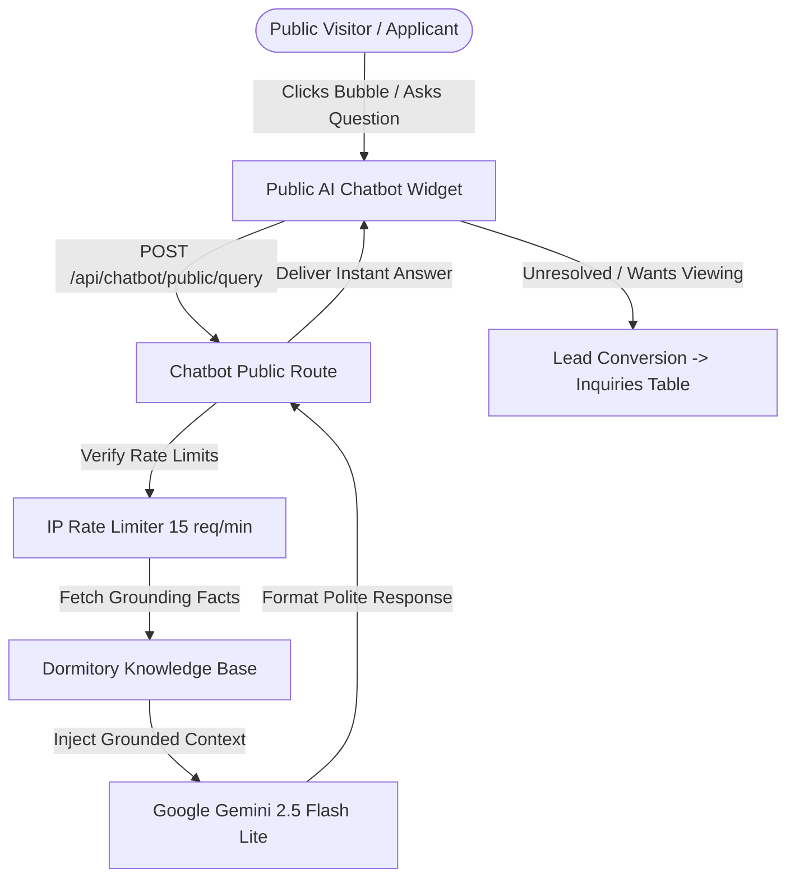

# Lilycrest DMS — Phase 1: Public Visitor & Applicant AI Chatbot Architecture Specification

## 1. Executive Summary & Objectives

The **Public Visitor & Applicant AI Chatbot** is the first customer-facing touchpoint in the Lilycrest Dormitory Management System (Lilycrest DMS). It serves as a 24/7 smart digital receptionist embedded on public pages (Landing Page, Room Browsing, and Registration Flow) to resolve prospective tenant inquiries immediately, reduce repetitive admin workloads, and accelerate conversion from inquiry to application.



### Key Objectives
1. **Instant Inquiry Resolution**: Answer questions on room pricing, branch locations, deposit rules, curfew, and amenities in < 1.5 seconds.
2. **Zero AI Hallucinations**: Ground all AI responses strictly in verified dormitory configuration data (no fabricated rates, discounts, or policies).
3. **Seamless Lead Capture**: Convert unresolved or viewing-related inquiries directly into actionable leads in the existing Admin Inquiry Pipeline (`/api/inquiries`).
4. **Frictionless Guided Application**: Assist applicants step-by-step through the 5-stage reservation workflow.

---

## 2. Target Personas & User Stories

### Persona 1: Prospective Resident (Guest / Visitor)
* **User Story**: *"As a university student or professional looking for a dormitory in Makati or Pasay, I want to ask about room types, monthly rates, and amenities without creating an account so that I can quickly decide if Lilycrest fits my budget."*
* **Core Interactions**:
  - Asking for room pricing at Gil Puyat vs. Guadalupe.
  - Inquiring about curfew hours, visitor policies, and appliance fees.
  - Checking nearest landmarks, LRT/MRT stations, and WiFi availability.

### Persona 2: Active Applicant (In Registration / Reservation Flow)
* **User Story**: *"As an applicant submitting my reservation, I want instant clarification on what valid IDs are accepted and how payment verification works so that my application is not delayed."*
* **Core Interactions**:
  - Asking what proof of income or student enrollment documents are required.
  - Inquiring about reservation deposit refundability.
  - Guidance on next steps after payment submission.

---

## 3. UI/UX Component Architecture (React / Vite)

Following the Lilycrest design guidelines (solid HSL tokens, 1px crisp borders, zero background gradients, high contrast):

### Component Hierarchy
```
web/src/features/public/
├── components/
│   ├── chatbot/
│   │   ├── PublicChatbotLauncher.jsx     # Floating bottom-right launcher button
│   │   ├── PublicChatbotModal.jsx        # Responsive chat window
│   │   ├── ChatMessageList.jsx           # Message thread container with auto-scroll
│   │   ├── ChatMessageBubble.jsx         # Individual bot / user speech bubble
│   │   ├── ChatQuickPrompts.jsx          # One-click suggestion pills
│   │   ├── ChatLeadEscalationForm.jsx    # Inline contact capture form
│   │   └── ChatTypingIndicator.jsx       # 3-dot subtle pulse indicator
│   └── faq/
│       ├── FAQSection.jsx                # Landing page FAQ accordion
│       └── FAQCategoryTabs.jsx           # Category switcher (Rates, Policies, Facilities)
```

### UI Behavior & Interaction Design
* **Floating Launcher**: Anchored at `bottom: 24px; right: 24px; z-index: 990;`. Clean circular button with `MessageSquare` icon and subtle unread badge indicator.
* **Responsive Modal**:
  - *Desktop*: 380px width, 560px height card with `1px solid var(--border)`, `box-shadow: var(--shadow-lg)`.
  - *Mobile (< 640px)*: Expands to full viewport overlay with top dismissal header to ensure thumb-friendly typing.
* **Quick Action Pills**: Pre-populated one-tap chips displayed on initial open:
  - 🏷️ *"What are your room rates?"*
  - 📍 *"Where are your branches located?"*
  - 🕒 *"What are the curfew & visitor rules?"*
  - 📝 *"How do I apply for a reservation?"*
* **Accessible Form Ergonomics**:
  - `Escape` key closes the modal.
  - Auto-focus on input field when modal opens.
  - Explicit `aria-live="polite"` region for screen readers.

---

## 4. Grounding Knowledge Base & Domain Data

The AI engine must be provided with a strictly curated, factual context snapshot. The knowledge base includes:

### 1. Branch Profiles & Locations
* **Gil Puyat Branch**: Located near Buendia / Taft Ave, Pasay City (near LRT-1 Gil Puyat Station, Arellano University, DLTB Bus Terminal).
* **Guadalupe Branch**: Located near EDSA Guadalupe Nuevo, Makati City (near MRT-3 Guadalupe Station, Guadalupe Mall, BGC Bus Terminal).

### 2. Room Types & Rate Structure
* **Quadruple Sharing Room**: 4 bunk beds, air-conditioned, personal locker, shared en-suite bathroom. (Base rate: ₱3,500 – ₱4,200 / month).
* **Double Sharing Room**: 2 single/bunk beds, air-conditioned, personal study table, shared en-suite bathroom. (Base rate: ₱5,500 – ₱6,500 / month).
* **Private Room**: 1 single bed, dedicated study desk, air-conditioned, en-suite private bathroom. (Base rate: ₱9,000 – ₱11,000 / month).

### 3. House Policies & House Rules
* **Curfew Policy**: Building entry gate locks at 11:00 PM and opens at 5:00 AM. Late entry permitted with prior written log or night-shift company ID.
* **Visitor Policy**: Registered daytime visitors allowed in common lounge areas from 8:00 AM to 8:00 PM. No overnight visitors in tenant dorm rooms.
* **Utility Billing Cycle**: Electricity and water billed every 15th of the month on a pro-rata shared consumption calculation.
* **Appliance Declaration**: Personal laptops/phones included free. Mini-refrigerators, rice cookers, and electric fans incur registered monthly surcharge fees.

### 4. 5-Step Guided Reservation Lifecycle
1. *Room Selection*: Choose preferred branch, room type, and bed position.
2. *Viewing Schedule / Waiver*: Choose in-person visit date or submit remote waiver.
3. *Tenant Information*: Submit personal, guardian/emergency, and government ID details.
4. *Payment Deposit*: Transfer 1-month advance + 1-month security deposit and upload payment receipt proof.
5. *Confirmation & Admin Approval*: Application is reviewed by Branch Admin within 24–48 hours.

---

## 5. Backend Architecture & API Contracts

### Endpoints Specification

#### 1. Public Conversational Query
* **Route**: `POST /api/chatbot/public/query`
* **Access**: Public (IP rate-limited)
* **Request Body**:
```json
{
  "message": "How much is a 4-person room in Guadalupe?",
  "conversationHistory": [
    { "role": "user", "text": "Hi" },
    { "role": "assistant", "text": "Hello! Welcome to Lilycrest. How can I assist you today?" }
  ]
}
```
* **Response Payload**:
```json
{
  "success": true,
  "data": {
    "reply": "At our Guadalupe branch, a Quadruple Sharing Room (4 beds) starts at ₱3,500 to ₱4,200 per person per month. This includes air-conditioning, personal locker, and access to study lounges and high-speed WiFi.",
    "suggestedActions": [
      { "label": "Browse Guadalupe Rooms", "url": "/applicant/check-availability?branch=guadalupe" },
      { "label": "Schedule a Visit", "action": "open_viewing_form" }
    ],
    "canEscalate": true
  }
}
```

#### 2. Unresolved Lead Escalation
* **Route**: `POST /api/chatbot/public/lead-escalation`
* **Access**: Public
* **Request Body**:
```json
{
  "name": "Maria Santos",
  "email": "maria.santos@gmail.com",
  "phone": "09171234567",
  "preferredBranch": "guadalupe",
  "message": "I would like to inquire if you have available rooms starting next month for a nursing student with night shifts.",
  "source": "chatbot_public"
}
```
* **Response Payload**:
```json
{
  "success": true,
  "data": {
    "inquiryId": "66bc891f0923ef12019488a1",
    "message": "Your inquiry has been sent to our Guadalupe branch admin team. We will contact you within 24 hours."
  }
}
```

---

## 6. AI Grounding Prompt Engineering (Gemini 2.5 Flash Lite)

```typescript
const SYSTEM_PROMPT = `
You are the official digital receptionist for Lilycrest Dormitory Management System (Lilycrest DMS).
Your mission is to provide courteous, precise, and professional assistance to prospective tenants and website visitors.

STRICT GROUNDING RULES:
1. Use ONLY the facts provided in the official dormitory context.
2. NEVER invent room prices, discounts, promotions, or policies.
3. If a question is outside the provided context, politely inform the user and suggest contacting the branch admin team.
4. Keep answers concise (maximum 3-4 sentences per response), clear, and warm.
5. Currency must always be formatted in Philippine Peso (PHP / ₱).
6. Always refer to our two official branches: "Gil Puyat Branch" (Pasay) and "Guadalupe Branch" (Makati).

OFFICIAL DORMITORY CONTEXT:
${dormitoryKnowledgeContext}
`;
```

---

## 7. Quality & Verification Gates

1. **Safety & Hallucination Test**: Test out-of-domain questions (*"Can I bring a pet dog?"* ➔ *"Pets are strictly not allowed under Lilycrest house rules"*).
2. **Speed & Latency**: Ensure average response time is under 1,500ms using `gemini-2.5-flash-lite`.
3. **Lead Integration**: Verify that escalating from chatbot creates a genuine record in MongoDB `Inquiry` collection.
4. **Mobile Responsiveness**: Test keyboard popup and viewport resizing across iOS Safari and Android Chrome.
