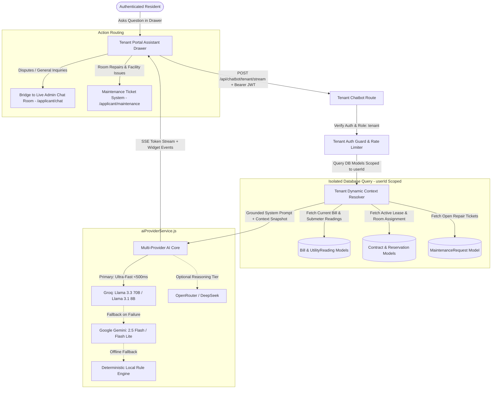
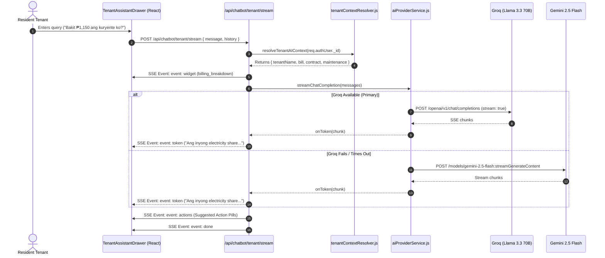

# Lilycrest DMS — Phase 2: Tenant Context-Aware AI Assistant Architecture Specification

## 1. Executive Summary & Objectives

The **Tenant Context-Aware AI Assistant** is an authenticated, intelligent copilot embedded directly within the Lilycrest Tenant Portal ([`TenantLayout.jsx`](file:///d:/Portfolio/3rdYear/CapstoneSystem/Capstone-Website/web/src/shared/layouts/TenantLayout.jsx)). Unlike generic chatbots, this assistant is securely connected to the resident's live stay data—enabling it to explain itemized monthly billing breakdowns (including submetered pro-rata electricity math), monitor lease contract deadlines, check active maintenance ticket status, and provide a 1-click escalation to human branch administrators.



### Key Objectives
1. **Plain-English Billing Explanations (Hybrid Breakdown)**: Deliver concise conversational Taglish/English summaries of monthly rent, registered appliance surcharges, and exact pro-rata electricity formulas alongside rich interactive billing cards.
2. **Contract & Lease Transparency**: Proactively inform tenants of remaining lease duration, move-out clearance requirements, security deposit status, and renewal eligibility.
3. **Maintenance Status Tracking**: Surface real-time status updates on active room repair tickets without confusing general inquiries with maintenance tickets.
4. **Strict Tenant Privacy Isolation**: Enforce zero cross-tenant data leakage by binding every database query strictly to `req.authUser._id`.
5. **Multi-Provider Resilience & Sub-Second Latency**: Deliver ultra-fast streaming responses via Groq (primary) with seamless failover to Google Gemini and local offline rule engines.
6. **Seamless Live Staff Handoff**: Bridge unresolved disputes or personal concerns directly into the WebSocket Live Chat room ([`/applicant/chat`](file:///d:/Portfolio/3rdYear/CapstoneSystem/Capstone-Website/web/src/features/tenant/pages/ChatPage.jsx)) with pre-filled context.

---

## 2. Multi-Provider AI Architecture & Cascade Routing

The assistant relies on a tiered multi-provider core configured in [`aiProviderService.js`](file:///d:/Portfolio/3rdYear/CapstoneSystem/Capstone-Website/server/services/chatbot/aiProviderService.js):

| Tier | Provider & Model | Role & SLA | Use Case |
| :--- | :--- | :--- | :--- |
| **Tier 1 (Primary)** | **Groq** (`llama-3.3-70b-versatile` / `llama-3.1-8b-instant`) | Ultra-low latency streaming (**< 500ms** Time-to-First-Token) | Primary conversational interface, real-time SSE token delivery, and natural Tagalog/Taglish fluency. |
| **Tier 2 (Secondary Fallback)** | **Google Gemini** (`gemini-2.5-flash` / `gemini-2.5-flash-lite`) | High-capacity reasoning & grounding (**< 2000ms**) | Automated failover if Groq encounters rate limits, network timeouts, or service unavailability. |
| **Tier 3 (Offline Rule Engine)** | **Lilycrest Deterministic Fallback** | Instant local response (**< 50ms**, 100% availability) | Extracts structured numbers from the context snapshot and formats exact answers even without external internet or AI API keys. |
| **Optional Tier** | **OpenRouter / DeepSeek** (`deepseek-chat` / `qwen-2.5`) | Deep analytical reasoning | Multi-month utility anomaly trend evaluation and complex contract clause comparisons. |



---

## 3. Real-World Resident Scenarios & Hybrid Responses

### Scenario A: The "Why Is My Electricity Bill Higher?" Inquiry (Hybrid Breakdown)
* **Tenant Message**: *"Bakit ₱1,150 ang electricity bill ko ngayong buwan? Mas mataas kaysa dati."*
* **Grounded Context Retrieved**:
  - Room Number: Room 304 (Quadruple Sharing, 4 active occupants)
  - Room Total Consumption: 320 kWh for the billing period
  - Submeter Rate: ₱14.375 / kWh $\rightarrow$ Total Room Electricity = ₱4,600.00
  - Pro-Rata Share: $\text{₱4,600.00} \div 4 = \text{₱1,150.00}$
  - Registered Appliances: ₱200.00 (Mini-refrigerator)
  - Base Rent: ₱3,500.00
  - Total Statement: ₱4,850.00 (Due Date: June 25, 2026)
* **AI Conversational Response (Option C)**:
  > *"Magandang araw po! Para sa billing cycle ng June 15, ang total electricity bill ng Room 304 ay **₱4,600.00** (320 kWh kabuuang konsumo). Dahil may **4 na aktibong boarders** sa inyong kwarto, ang inyong pantay na pro-rata share ay **₱1,150.00**.*
  > 
  > *Mayroon din po kayong **₱200.00** para sa registered mini-fridge at **₱3,500.00** base rent para sa kabuuang **₱4,850.00** na due sa **June 25, 2026**."*
* **Injected Interactive Card**: Automatically displays [`TenantBillingBreakdownCard.jsx`](file:///d:/Portfolio/3rdYear/CapstoneSystem/Capstone-Website/web/src/features/tenant/components/assistant/cards/TenantBillingBreakdownCard.jsx) with direct action buttons:
  - `[Pay via PayMongo]` $\rightarrow$ triggers payment modal or redirects to `/applicant/billing?action=pay`
  - `[View Statement Breakdown]` $\rightarrow$ navigates to `/applicant/billing`

---

### Scenario B: Lease Expiration, Clearance & Deposit Inquiry
* **Tenant Message**: *"Kailan matatapos ang contract ko at paano ko makukuha ang security deposit?"*
* **Grounded Context Retrieved**:
  - Lease End Date: August 31, 2026 (42 days remaining)
  - Security Deposit Balance: ₱3,500.00
  - Renewal Status: Eligible for 6-month or 1-year renewal
* **AI Conversational Response**:
  > *"Ang inyong lease contract para sa Room 304 (Bed A) ay magtatapos sa **August 31, 2026** (**42 days** na lang po ang natitira).*
  > 
  > *Para sa inyong **₱3,500.00 security deposit refund**:*
  > *1. Magsumite ng Move-Out Clearance request sa portal nang hindi bababa sa 30 days bago ang end date.*
  > *2. I-settle ang inyong huling submeter electricity reading.*
  > *3. Isauli ang room key at completed inventory checklist sa branch front desk.*
  > 
  > *Kung nais po ninyong mag-renew ng kontrata, maaari kayong mag-apply directly sa portal."*
* **Injected Interactive Card**: Automatically displays [`TenantLeaseTimelineCard.jsx`](file:///d:/Portfolio/3rdYear/CapstoneSystem/Capstone-Website/web/src/features/tenant/components/assistant/cards/TenantLeaseTimelineCard.jsx) with action pills:
  - `[Request Lease Renewal]` $\rightarrow$ opens [`LeaseRenewalModal.jsx`](file:///d:/Portfolio/3rdYear/CapstoneSystem/Capstone-Website/web/src/features/tenant/components/LeaseRenewalModal.jsx)
  - `[View Contract Details]` $\rightarrow$ navigates to `/applicant/contracts`

---

### Scenario C: Room Repair Status vs General Inquiry
* **Tenant Message**: *"May balita na ba sa sirang aircon sa room namin?"*
* **Grounded Context Retrieved**:
  - Active Ticket: `REQ-882104` (Air Conditioner Repair)
  - Status: `IN_PROGRESS`
  - Assigned Provider: CoolAir Services (Scheduled: Tomorrow, 2:00 PM)
* **AI Conversational Response**:
  > *"Opo! Ang inyong active maintenance ticket para sa aircon (**REQ-882104**) ay kasalukuyang **IN PROGRESS**. Naka-assign na po ito sa CoolAir Services at naka-schedule ang technician visit bukas ng **2:00 PM**."*
* **Injected Interactive Card**: Displays [`TenantMaintenanceCard.jsx`](file:///d:/Portfolio/3rdYear/CapstoneSystem/Capstone-Website/web/src/features/tenant/components/assistant/cards/TenantMaintenanceCard.jsx).
* **Clear Workflow Boundary**:
  - To follow up on this repair $\rightarrow$ routes to [`/applicant/maintenance`](file:///d:/Portfolio/3rdYear/CapstoneSystem/Capstone-Website/web/src/features/tenant/pages/MaintenancePage.jsx) (**Maintenance Ticket Module**).
  - To dispute a billing surcharge or talk to administrative staff $\rightarrow$ routes to [`/applicant/chat`](file:///d:/Portfolio/3rdYear/CapstoneSystem/Capstone-Website/web/src/features/tenant/pages/ChatPage.jsx) (**Live Admin Chat Room**).

---

## 4. UI/UX Component Architecture (React / Vite)

Following the Lilycrest design standards (solid HSL tokens, 1px crisp borders, strictly zero gradients, no cookie-cutter AI templates):

```
web/src/features/tenant/
├── components/
│   ├── assistant/
│   │   ├── TenantAssistantDrawer.jsx        # Slide-over responsive drawer (420px desktop / full mobile)
│   │   ├── TenantAssistantLauncher.jsx      # Persistent portal floating / header trigger button
│   │   ├── cards/
│   │   │   ├── TenantBillingBreakdownCard.jsx # Submeter math + line item visual card
│   │   │   ├── TenantLeaseTimelineCard.jsx    # Lease days remaining + deposit pill
│   │   │   └── TenantMaintenanceCard.jsx      # Active repair ticket status badge
│   │   ├── modals/
│   │   │   └── TenantHumanEscalateModal.jsx   # Live Admin Chat handoff confirmation
│   │   └── index.js
```

### Drawer Interaction Design
* **Slide-Over Panel**: Anchored to the right viewport (`w-[420px]` on desktop, full-width on mobile viewports).
* **Session Persistence**: Maintains conversation history in `sessionStorage` (`lilycrest_tenant_assistant_msgs`) during page transitions across the portal.
* **Route-Aware Quick Prompts**: Adapts prompt chips based on the tenant's active URL:
  - On [`/applicant/billing`](file:///d:/Portfolio/3rdYear/CapstoneSystem/Capstone-Website/web/src/features/tenant/pages/BillingPage.jsx): *"Electricity math"*, *"Payment due date"*, *"Water consumption"*.
  - On [`/applicant/contracts`](file:///d:/Portfolio/3rdYear/CapstoneSystem/Capstone-Website/web/src/features/tenant/pages/ContractsPage.jsx): *"Lease expiration"*, *"Renew contract"*, *"Deposit refund"*.
  - On [`/applicant/maintenance`](file:///d:/Portfolio/3rdYear/CapstoneSystem/Capstone-Website/web/src/features/tenant/pages/MaintenancePage.jsx): *"Active tickets"*, *"Report issue"*, *"Technician hours"*.
* **One-Click Human Transfer**: Persistent *"Talk to Admin"* button in the drawer header and suggested action pills that initiates the Live Chat escalation flow.

---

## 5. Escalation Routing vs Maintenance Ticket Separation

To maintain architectural clarity and prevent user confusion, support channels are strictly separated by intent:

```mermaid
flowchart LR
    Intent{Tenant Intent / Concern}
    
    Intent -->|Facility Failure / Broken Item\nPlumbing, AC, Lights, Locks| MaintFlow[Maintenance Ticket System]
    MaintFlow --> MaintPage[/applicant/maintenance]
    MaintFlow --> MaintModel[(MaintenanceRequest DB Model)]
    MaintFlow --> TechAssignment[Technician Job Dispatch]
    
    Intent -->|Billing Dispute / Rent Extension\nRoommate Dispute / General Inquiries| ChatFlow[Live Admin Chat Bridge]
    ChatFlow --> EscalateModal[TenantHumanEscalateModal]
    EscalateModal --> ChatRoute[POST /api/chatbot/tenant/escalate]
    ChatRoute --> LiveChatPage[/applicant/chat]
    ChatRoute --> WSServer[(WebSocket Live Chat Thread)]
```

| Dimension | Live Admin Chat Escalation | Maintenance Ticket Workflow |
| :--- | :--- | :--- |
| **Primary Route** | [`/applicant/chat`](file:///d:/Portfolio/3rdYear/CapstoneSystem/Capstone-Website/web/src/features/tenant/pages/ChatPage.jsx) | [`/applicant/maintenance`](file:///d:/Portfolio/3rdYear/CapstoneSystem/Capstone-Website/web/src/features/tenant/pages/MaintenancePage.jsx) |
| **Data Model** | `Conversation` / `Message` (Real-time WebSockets) | `MaintenanceRequest` (Strict Ticket Lifecycle) |
| **Responsible Party** | Branch Front Desk / Admin Team | Accredited Facility Technicians / Electricians |
| **Ticket Numbering** | N/A (Standard Chat Thread) | Formal Code: `REQ-XXXXXX` |
| **Supported Actions** | Text discussion, bill adjustment reviews, payment agreements. | Photo uploads, urgency ratings, technician dispatch, completion sign-off. |

---

## 6. Backend Context Resolver & API Contracts

### 1. Dynamic Context Resolver (`tenantContextResolver.js`)
Builds an in-memory snapshot strictly bounded to `req.authUser._id`:

```javascript
// /server/services/chatbot/tenantContextResolver.js
export async function resolveTenantAIContext(userId, fallbackAuthUser = null) {
  // Queries strictly matching userId
  const [dbUser, activeReservation, contract, latestBill, activeMaintenance] = await Promise.all([
    User.findById(userId).select("firstName lastName email branch roomNumber roomBed contactNumber").lean(),
    Reservation.findOne({ userId, isArchived: false, status: { $in: CURRENT_RESIDENT_STATUS_QUERY } })
      .populate("roomId", "name roomNumber branch type floor")
      .sort({ createdAt: -1 }).lean(),
    Contract.findOne({ tenantId: userId, isArchived: { $ne: true } })
      .sort({ createdAt: -1 }).lean(),
    Bill.findOne({ userId, isArchived: false })
      .sort({ billingMonth: -1, createdAt: -1 }).lean(),
    MaintenanceRequest.find({ userId })
      .sort({ createdAt: -1 }).limit(5).lean(),
  ]);

  return {
    tenantName: `${dbUser.firstName} ${dbUser.lastName}`.trim(),
    branch: formatBranchName(dbUser.branch || contract?.branch),
    roomNumber: dbUser.roomNumber || contract?.roomNumber || "304",
    bedPosition: dbUser.roomBed || contract?.bedLabel || "Bed 1",
    currentBill: latestBill ? {
      billId: latestBill._id,
      month: latestBill.billingMonth,
      totalAmount: latestBill.totalAmount,
      rentAmount: latestBill.rentAmount,
      electricityAmount: latestBill.electricityAmount,
      waterAmount: latestBill.waterAmount,
      applianceAmount: latestBill.applianceAmount,
      penaltyAmount: latestBill.penaltyAmount,
      status: latestBill.status,
      dueDate: latestBill.dueDate,
    } : null,
    contract: contract ? {
      contractNumber: contract.contractNumber,
      startDate: contract.startDate,
      endDate: contract.endDate,
      daysRemaining: calculateDaysRemaining(contract.endDate),
      monthlyRate: contract.monthlyRent,
      depositAmount: contract.securityDeposit,
      status: contract.status,
    } : null,
    activeMaintenance: activeMaintenance.map(t => ({
      ticketCode: t.ticketNumber || String(t._id),
      category: t.category || t.request_type,
      urgency: t.priority || "normal",
      status: t.status,
      scheduledDate: t.scheduledDate,
    })),
  };
}
```

---

### 2. API Endpoints

#### Endpoint A: Real-Time SSE Stream
* **Route**: `POST /api/chatbot/tenant/stream`
* **Access**: Authenticated (`verifyToken` + `role: tenant`)
* **Headers**: `Content-Type: application/json` $\rightarrow$ Responds with `text/event-stream`
* **Request Body**:
```json
{
  "message": "Bakit ₱1,150 ang electricity bill ko?",
  "conversationHistory": [
    { "role": "user", "text": "Hello" },
    { "role": "assistant", "text": "Mabuhay! Paano po kita matutulungan ngayon?" }
  ]
}
```
* **SSE Event Stream Protocol**:
```http
HTTP/1.1 200 OK
Content-Type: text/event-stream
Cache-Control: no-cache
Connection: keep-alive

event: widget
data: {"type":"billing_breakdown","title":"Current Statement of Account","data":{"bill":{"totalAmount":4850,"rentAmount":3500,"electricityAmount":1150,"applianceCharges":200,"dueDate":"2026-06-25"},"waterIncluded":true}}

event: token
data: {"token":"Magandang "}

event: token
data: {"token":"araw po! Para sa "}

event: token
data: {"token":"billing cycle..."}

event: actions
data: [{"label":"View Billing Statement","url":"/applicant/billing"},{"label":"Talk to Branch Admin","action":"open_escalate_modal"}]

event: done
data: {"completed":true,"fullReply":"Magandang araw po!..."}
```

#### Endpoint B: Live Admin Chat Escalation Bridge
* **Route**: `POST /api/chatbot/tenant/escalate`
* **Access**: Authenticated (`verifyToken` + `role: tenant`)
* **Request Body**:
```json
{
  "category": "billing_dispute",
  "priority": "high",
  "summary": "Tenant requesting review of electricity share calculation for June cycle.",
  "lastBotMessage": "Your electricity share is ₱1,150.00 based on Room 304 320 kWh usage."
}
```
* **Response Payload**:
```json
{
  "success": true,
  "data": {
    "conversationId": "66bc891f0923ef12019488f9",
    "status": "active",
    "assignedAdmin": "Guadalupe Front Desk Admin",
    "redirectUrl": "/applicant/chat?conversationId=66bc891f0923ef12019488f9",
    "message": "Escalated to live chat. Admin has received your context summary."
  }
}
```

---

## 7. Bilingual System Prompt & Safety Guardrails

### System Prompt Definition
```
You are the dedicated Lilycrest Tenant AI Assistant for Lilycrest Dormitory Management System (Lilycrest DMS).
You assist active dormitory residents with clear, professional, and courteous English, providing precise, grounded answers based on the resident's actual stay record.

AUTHENTICATED TENANT PROFILE:
- Tenant Name: {{tenantName}}
- Branch: {{branch}}
- Room Number: Room {{roomNumber}} ({{bedPosition}})
- Base Monthly Rent: ₱{{monthlyRent}}/month

ACTIVE LEASE CONTRACT:
- Status: {{contractStatus}}
- Lease End Date: {{leaseEndDate}} ({{daysRemaining}} days remaining)
- Security Deposit: ₱{{depositAmount}}

LATEST BILLING STATEMENT:
- Total Due: ₱{{totalAmount}} (Due Date: {{dueDate}})
- Rent: ₱{{rentAmount}} | Electricity: ₱{{electricityAmount}} | Water: Free (Included in rent)
- Appliance Fees: ₱{{applianceAmount}}

ACTIVE MAINTENANCE TICKETS:
{{maintenanceListFormatted}}

DORMITORY POLICIES:
1. Curfew: 11:00 PM to 5:00 AM. 24/7 late entry permitted with valid student/work ID.
2. Electricity: Metered per room submeter and split pro-rata among room occupants monthly.
3. Amenities: High-speed Wi-Fi and Water consumption are 100% free and included in rent.
4. Maintenance: Facility repair tickets are submitted strictly via the Maintenance Portal.

STRICT BEHAVIOR RULES:
1. Language & Tone: Always respond in clear, professional English by default. Do NOT insert filler honorifics such as "po" or "opo" in English sentences.
2. Answer concisely (2 to 4 sentences maximum).
3. Ground all numbers strictly on the tenant's data provided above. Never fabricate bills, dates, or ticket statuses.
4. If the tenant has a billing dispute or unlisted concern, offer to bridge them to the Branch Admin via Live Chat.
```

### Safety & Privacy Isolation Guardrails
1. **Mathematical User Isolation**: Every database operation queries `userId: req.authUser._id`. It is strictly impossible for a tenant to inspect another resident's room number, contact info, or payment history.
2. **Read-Only Enclosure**: The AI assistant has zero database mutation permissions. It cannot modify invoices, alter move-out dates, or grant financial waivers.
3. **Trace Sanitization**: Internal database stack traces and LLM provider keys are never exposed in SSE error streams or client payloads.

---

## 8. Performance SLAs & Quality Verification Gates

1. **Streaming Latency SLA**:
   - Time-to-First-Token (TTFT) via Groq: **< 500ms**
   - Fallback failover trigger: **< 3000ms**
2. **Pro-Rata Math Precision**:
   - Submeter arithmetic ($Total \div Occupants$) must match the database billing charge to 2 decimal places.
3. **Zero-Downtime Resilience**:
   - If Groq and Gemini APIs are simultaneously unreachable, the deterministic rule-based engine must stream complete, grounded fallback answers with 100% uptime.
4. **WebSocket Event Verification**:
   - Escalating to Live Chat must emit `chat:message-new` to the branch admin dashboard in real-time.
