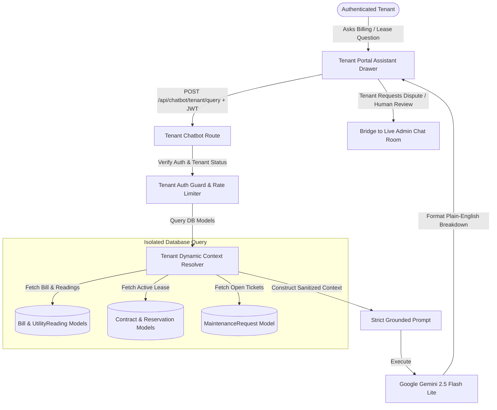

# Lilycrest DMS — Phase 2: Tenant Context-Aware AI Assistant Architecture Specification

## 1. Executive Summary & Objectives

The **Tenant Context-Aware AI Assistant** is an authenticated, intelligent copilot embedded directly within the Lilycrest Tenant Portal ([`TenantLayout.jsx`](file:///d:/Portfolio/3rdYear/CapstoneSystem/Capstone-Website/web/src/shared/layouts/TenantLayout.jsx)). Unlike generic chatbots, this assistant is securely connected to the tenant's real-time account data—allowing it to explain itemized monthly billing breakdowns (including complex pro-rata electricity math), monitor lease contract deadlines, check maintenance ticket status, and provide a 1-click escalation to human branch admins.



### Key Objectives
1. **Plain-English Billing Explanations**: Dissect complex rent, appliance surcharges, and pro-rata electricity formulas into friendly, self-explanatory summaries.
2. **Contract & Lease Transparency**: Proactively inform tenants of remaining lease duration, move-out clearance requirements, and deposit balances.
3. **Maintenance Self-Service**: Assist in categorizing repair tickets with photo attachments and tracking technician visits.
4. **Strict Tenant Privacy Isolation**: Enforce zero cross-tenant data leakage by binding every prompt exclusively to `req.authUser._id`.
5. **Seamless Staff Handoff**: Bridge complex disputes directly into the existing WebSocket human chat system (`/api/chat`).

---

## 2. Target Personas & Core User Scenarios

### Persona: Active Resident (Tenant Role)
* **Demographics**: College students or working professionals residing at Lilycrest Gil Puyat or Guadalupe.
* **Key Challenges**:
  - Confused about why their electricity bill fluctuates between summer and rainy months.
  - Forgetting when their contract ends or when renewal deposits are due.
  - Wondering if an electrician has been assigned to their broken room outlet.

### Real-World Use Cases & Expected AI Outputs

#### Scenario A: The "Why Is My Bill Higher?" Inquiry
* **Tenant Input**: *"Why is my bill this month ₱4,850? Last month was only ₱4,100."*
* **AI Context Retrieved**:
  - Rent: ₱3,500
  - Appliances: ₱200 (mini-ref declared)
  - Room Electricity: ₱1,150 (Room consumed 320 kWh across 4 occupants over 30 days)
  - Water: Free (included in base rent)
* **AI Output**:
  > *"Your total bill for the June 15 billing cycle is **₱4,850.00**. Here is the exact breakdown:*
  > * * **Base Room Rent**: ₱3,500.00*
  > * * **Registered Appliance**: ₱200.00 (Mini-refrigerator)*
  > * * **Electricity Share**: ₱1,150.00*
  > 
  > *The ₱750 increase from last month is due to higher room electricity usage (Room 304 recorded 320 kWh total, split evenly across 4 active bed occupants). Your payment due date is **June 25, 2026**."*

#### Scenario B: Contract Expiration & Security Deposit Inquiry
* **Tenant Input**: *"When does my contract end, and how do I get my deposit back?"*
* **AI Context Retrieved**:
  - Contract End Date: August 31, 2026
  - Days Remaining: 42 days
  - Security Deposit: ₱3,500.00
  - Clearance Status: Not started
* **AI Output**:
  > *"Your current lease for Room 304 Bed A ends on **August 31, 2026** (42 days remaining).*
  > 
  > *To receive your **₱3,500.00 security deposit refund**:*
  > *1. Submit your Move-Out Clearance request at least 30 days before your end date.*
  > *2. Settle your final utility meter readings.*
  > *3. Return your room key and room inventory checklist to the Guadalupe front desk.*
  > 
  > *Would you like me to open the Move-Out Clearance page for you?"*

---

## 3. UI/UX Component Architecture (React / Vite)

Following the Lilycrest design guidelines (solid HSL tokens, 1px borders, zero gradients, no cookie-cutter AI pills):

### Component Hierarchy
```
web/src/features/tenant/
├── components/
│   ├── assistant/
│   │   ├── TenantAssistantDrawer.jsx      # Slide-over side panel
│   │   ├── TenantAssistantLauncher.jsx    # Persistent header or bottom helper icon
│   │   ├── TenantBillingBreakdownCard.jsx # Formatted bill explanation summary
│   │   ├── TenantLeaseTimelineCard.jsx    # Contract timeline pill
│   │   ├── TenantActionButtons.jsx        # Direct links (Pay via PayMongo, Request Maintenance)
│   │   └── TenantHumanEscalateModal.jsx   # Transfer confirmation to Branch Admin
```

### UI Behavior & Interaction Design
* **Slide-Over Drawer**: Right-side sliding panel (420px width on desktop, full screen on mobile) that does not obstruct background table data.
* **Contextual Suggestions**: Dynamically adapts suggestions based on the active route:
  - When on [`/applicant/billing`](file:///d:/Portfolio/3rdYear/CapstoneSystem/Capstone-Website/web/src/features/tenant/pages/BillingPage.jsx): Prompts *"Explain my electricity charge"*, *"When is my next due date?"*, *"Show payment methods"*.
  - When on [`/applicant/contracts`](file:///d:/Portfolio/3rdYear/CapstoneSystem/Capstone-Website/web/src/features/tenant/pages/ContractsPage.jsx): Prompts *"How do I renew my lease?"*, *"Check deposit status"*.
  - When on [`/applicant/maintenance`](file:///d:/Portfolio/3rdYear/CapstoneSystem/Capstone-Website/web/src/features/tenant/pages/MaintenancePage.jsx): Prompts *"Track my plumbing ticket"*, *"Report a new electrical issue"*.
* **One-Click Human Transfer**: A clear, prominent button: *"Chat with Branch Admin"*. Clicking this automatically opens a new conversation thread in [`chatRoutes.js`](file:///d:/Portfolio/3rdYear/CapstoneSystem/Capstone-Website/server/routes/chatRoutes.js) and tags it with the relevant category.

---

## 4. Backend Context Resolver Architecture

To ensure speed and security, the backend builds an in-memory **Tenant Snapshot** for every AI query:

```javascript
// Server-side context builder: /server/services/chatbot/tenantContextResolver.js
export async function resolveTenantAIContext(userId) {
  const [user, activeReservation, latestBill, openTickets] = await Promise.all([
    User.findById(userId).select("firstName lastName email branch roomNumber roomBed").lean(),
    Reservation.findOne({ userId, status: { $in: CURRENT_RESIDENT_STATUS_QUERY }, isArchived: false })
      .populate("roomId", "name roomNumber branch type floor")
      .lean(),
    Bill.findOne({ tenantId: userId, isArchived: false })
      .sort({ createdAt: -1 })
      .lean(),
    MaintenanceRequest.find({ tenantId: userId, status: { $in: ["pending", "in_progress"] } })
      .sort({ createdAt: -1 })
      .limit(3)
      .lean(),
  ]);

  return {
    tenantName: `${user.firstName} ${user.lastName}`.trim(),
    branch: user.branch || activeReservation?.roomId?.branch,
    roomNumber: user.roomNumber || activeReservation?.roomId?.roomNumber,
    bedPosition: user.roomBed || activeReservation?.selectedBed?.id,
    currentBill: latestBill ? {
      month: latestBill.month || latestBill.billingPeriod,
      totalAmount: latestBill.totalAmount,
      rentAmount: latestBill.rentAmount,
      electricityAmount: latestBill.electricityAmount,
      waterAmount: latestBill.waterAmount,
      applianceAmount: latestBill.applianceAmount,
      penaltyAmount: latestBill.penaltyAmount,
      status: latestBill.status,
      dueDate: latestBill.dueDate,
    } : null,
    contract: activeReservation ? {
      startDate: activeReservation.moveInDate,
      endDate: activeReservation.moveOutDate,
      depositAmount: activeReservation.depositAmount || activeReservation.totalPrice,
    } : null,
    activeMaintenance: openTickets.map(t => ({
      ticketCode: t.ticketCode || t._id,
      category: t.request_type || t.typeLabel,
      urgency: t.urgency,
      status: t.status,
      submittedDate: t.createdAt,
    })),
  };
}
```

---

## 5. API Contracts & Endpoints

### 1. Tenant Assistant Conversational Query
* **Route**: `POST /api/chatbot/tenant/query`
* **Access**: Authenticated (`verifyToken` + `role: tenant`)
* **Rate Limit**: 30 requests / 15 minutes per user
* **Request Body**:
```json
{
  "message": "Can you explain why I have an appliance fee?",
  "conversationHistory": []
}
```
* **Response Payload**:
```json
{
  "success": true,
  "data": {
    "reply": "Your current bill includes an appliance fee of ₱200.00 for your registered personal mini-refrigerator in Room 304. Under dormitory policy, personal cooling appliances incur a standard monthly surcharge.",
    "contextSnapshot": {
      "billId": "66bc891f0923ef12019488b4",
      "dueDate": "2026-06-25T00:00:00.000Z",
      "status": "pending"
    },
    "suggestedActions": [
      { "label": "Pay via PayMongo", "url": "/applicant/billing?action=pay" },
      { "label": "Speak with Branch Admin", "action": "escalate_to_admin" }
    ]
  }
}
```

### 2. Human Admin Escalation Bridge
* **Route**: `POST /api/chatbot/tenant/escalate`
* **Access**: Authenticated (`verifyToken` + `role: tenant`)
* **Request Body**:
```json
{
  "category": "billing_concern",
  "priority": "normal",
  "summary": "Tenant is disputing June electricity consumption pro-rata calculation.",
  "lastBotMessage": "Your electricity share is ₱1,150.00 for June 15 cycle."
}
```
* **Response Payload**:
```json
{
  "success": true,
  "data": {
    "conversationId": "66bc891f0923ef12019488f9",
    "status": "open",
    "assignedAdminName": "Guadalupe Admin Team",
    "redirectUrl": "/applicant/chat?conversationId=66bc891f0923ef12019488f9"
  }
}
```

---

## 6. Security, Isolation & Safety Guardrails

1. **Strict User Binding**: The backend queries only records matching `userId = req.authUser._id`. It is mathematically impossible for a tenant to prompt-inject or query another resident's room number, contact number, or payment history.
2. **Sanitized AI System Prompt**: The system prompt instructs Gemini:
   * *"You are Lilycrest's Tenant Assistant. You ONLY have access to the specific tenant's JSON record provided in this session. NEVER reveal internal admin notes, technician personal phone numbers, or other tenants' details."*
3. **No Financial Mutations**: The AI assistant is strictly read-only. It cannot modify bills, approve waivers, or alter lease dates; all financial actions must go through formal admin controller routes.

---

## 7. Quality & Verification Gates

1. **Pro-Rata Math Accuracy**: Verify that electricity arithmetic explained by the AI matches the database record to 2 decimal places.
2. **Contract Timing Accuracy**: Verify date calculation (days remaining) against current system time.
3. **Socket Event Verification**: Verify that escalating to human emits `chat:message-new` to the branch admin dashboard in real-time.
4. **Offline Fallback**: When Gemini API is unreachable, provide a structured rule-based fallback card with raw bill line items.
