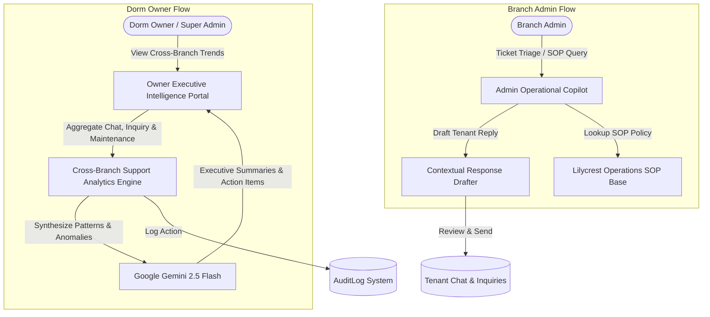

# Lilycrest DMS — Phase 3: Admin Operational Copilot & Dorm Owner Intelligence Specification

## 1. Executive Summary & Objectives

The **Admin Operational Copilot & Dorm Owner Intelligence** subsystem empowers dormitory administrators and owners with AI-assisted operational agility and cross-branch executive decision intelligence. 

For **Branch Admins**, it acts as an intelligent SOP (Standard Operating Procedure) advisor and auto-drafting assistant for tenant concerns. For **Dorm Owners (Super Admins)**, it synthesizes customer inquiries, maintenance tickets, and support conversations across both Gil Puyat and Guadalupe branches into high-level trend analyses, issue clustering, and strategic operational recommendations.



### Key Objectives
1. **Accelerate Admin Response Times**: Reduce ticket triage and resolution time by generating high-quality, courteous draft replies grounded in tenant history.
2. **SOP Consistency**: Provide instant, standardized operational guidance for move-outs, utility disputes, and deposit refunds.
3. **Cross-Branch Support Visibility**: Give owners a unified dashboard comparing support ticket volume, resolution speed, and recurring customer pain points between Gil Puyat and Guadalupe.
4. **Actionable Executive Summaries**: Automatically convert thousands of support events into concise management takeaways and risk alerts.

---

## 2. Personas & Feature Capabilities

### Persona A: Branch Admin (Gil Puyat / Guadalupe Operations)

#### Feature 1: Standard Operating Procedure (SOP) Assistant
* **Problem**: Branch admins frequently need to confirm specific policies (e.g., *"How many days does a tenant have to settle an overdue electricity bill before penalties apply?"* or *"What is the exact checklist for Room Clearance?"*).
* **AI Solution**: An inline operational assistant drawer where admins can ask natural language operational questions and receive instant, step-by-step SOP checklists.

#### Feature 2: Smart Contextual Response Drafter
* **Problem**: Admins spend hours typing repetitive replies to tenant questions across [`AdminChatPage.jsx`](file:///d:/Portfolio/3rdYear/CapstoneSystem/Capstone-Website/web/src/features/admin/pages/AdminChatPage.jsx) and [`InquiriesPage.jsx`](file:///d:/Portfolio/3rdYear/CapstoneSystem/Capstone-Website/web/src/features/admin/pages/InquiriesPage.jsx).
* **AI Solution**: A **"Generate AI Reply Draft"** button inside the conversation panel. The AI analyzes the tenant's issue, checks their room and bill status, and prepares a polite, formal response for the admin to review, tweak, and send with one click.

#### Feature 3: Room/Floor Issue Clustering Alert
* **Problem**: Multiple tenants on the same floor reporting separate plumbing or breaker issues can indicate a systemic building problem.
* **AI Solution**: An automated pattern detector that alerts admins:  
  *(e.g., "⚠️ 3 separate water pressure complaints logged for 2nd Floor Guadalupe within the last 48 hours. Recommend inspecting the secondary water booster pump.")*

---

### Persona B: Dorm Owner (Super Admin Executive Governance)

#### Feature 1: Cross-Branch Support & Inquiry Trends
* **Cross-Branch Comparison**:
  - Total inquiry and ticket volume: Gil Puyat vs. Guadalupe.
  - Average response and resolution SLA (hours).
  - Category breakdown: Billing (%), Maintenance (%), Policy/Rules (%), Reservation (%).

#### Feature 2: Common Issue Clustering Across Branches
* Aggregates sentiment and recurring keywords across all chat logs, contact submissions, and maintenance tickets to identify systemic dormitory challenges:
  - *Example*: High volume of aircon inquiries in Gil Puyat due to summer heat vs. water pressure inquiries in Guadalupe.

#### Feature 3: Strategic AI Executive Decision Summaries
* Deep integration with [`analyticsInsightsService.js`](file:///d:/Portfolio/3rdYear/CapstoneSystem/Capstone-Website/server/services/analyticsInsightsService.js) to generate executive decision memos for owners:
  - **Findings**: Top 3 customer pain points this month.
  - **Risk Alerts**: Rooms with recurring maintenance costs exceeding 15% of annual rental revenue.
  - **Strategic Action Recommendations**: Prioritized list of operational fixes and staff training opportunities.

---

## 3. UI/UX Component Architecture (React / Vite)

Following the Lilycrest design guidelines (clean 1px solid borders, solid HSL tokens, no gradients, zero layout shifts):

### Component Hierarchy
```
web/src/features/admin/
├── components/
│   ├── copilot/
│   │   ├── AdminCopilotDrawer.jsx        # Slide-over operational assistant for Admins
│   │   ├── AdminReplyDraftButton.jsx     # Inline 1-click draft button in Admin Chat
│   │   ├── AdminSopReferenceModal.jsx    # Standard operating procedure lookup modal
│   │   └── AdminIssueClusterBanner.jsx   # Repeated issue warning banner
│   └── analytics/
│       ├── SupportTrendsTab.jsx          # Owner Support & Inquiry Analytics tab
│       ├── SupportIssueClusterCard.jsx   # Grouped common issue cards
│       └── ExecutiveAiSummaryCard.jsx    # Executive takeaways & recommendation panel
```

### UI Interaction Standards
* **Admin Chat Integration**: The *"Generate Draft"* button sits directly above the chat composer in [`AdminChatPage.jsx`](file:///d:/Portfolio/3rdYear/CapstoneSystem/Capstone-Website/web/src/features/admin/pages/AdminChatPage.jsx). Clicking it populates the text area with an editable draft in under 1 second without auto-sending.
* **Owner Analytics Tabs**: Integrated seamlessly into the existing [Analytics Page](file:///d:/Portfolio/3rdYear/CapstoneSystem/Capstone-Website/web/src/features/admin/pages/AnalyticsPage.jsx) navigation alongside Billing, Occupancy, Operations, and Demographics.
* **Accessible Contrast & Skeletons**: Standard skeleton loaders (`AdminTablePageSkeleton`, `AdminDashboardSkeleton`) during data fetches.

---

## 4. Backend Architecture & API Specifications

### Endpoints Specification

#### 1. Admin Operational SOP Query
* **Route**: `POST /api/chatbot/admin/sop-query`
* **Access**: Authenticated (`verifyToken`, `verifyAdmin`, `filterByBranch`)
* **Request Body**:
```json
{
  "query": "What is the procedure when a tenant reports a lost room key?"
}
```
* **Response Payload**:
```json
{
  "success": true,
  "data": {
    "answer": "When a tenant reports a lost key:\n1. Verify tenant identity via profile photo and ID.\n2. Issue temporary master key for immediate room access (logged in Front Desk Key Log).\n3. Assess ₱250.00 key replacement fee on tenant's next billing invoice.\n4. Front desk duplicates key within 24 hours and updates key inventory.",
    "policyReference": "Lilycrest Operations Manual §7.2 (Key & Lock Governance)"
  }
}
```

#### 2. Contextual Reply Drafter for Admin Chat
* **Route**: `POST /api/chatbot/admin/suggest-reply`
* **Access**: Authenticated (`verifyToken`, `verifyAdmin`, `filterByBranch`)
* **Request Body**:
```json
{
  "conversationId": "66bc891f0923ef12019488f9",
  "ticketCategory": "maintenance_concern",
  "urgency": "high",
  "recentMessages": [
    { "senderRole": "tenant", "message": "The water in our bathroom has no pressure and it is brown." }
  ]
}
```
* **Response Payload**:
```json
{
  "success": true,
  "data": {
    "suggestedReply": "Hi! Thank you for notifying us. We apologize for the inconvenience. We have escalated this urgent plumbing issue to our on-call maintenance technician, and someone will inspect the water line for Room 204 within the next 30 minutes. We will keep you updated.",
    "confidence": "high",
    "recommendedActions": [
      { "label": "Assign Provider", "action": "open_provider_modal" },
      { "label": "Mark Urgent", "action": "set_priority_urgent" }
    ]
  }
}
```

#### 3. Dorm Owner Cross-Branch Support Trends
* **Route**: `GET /api/chatbot/owner/support-trends`
* **Access**: Authenticated (`verifyToken`, `verifyOwner`)
* **Query Parameters**: `?timeframe=30d&branch=all`
* **Response Payload**:
```json
{
  "success": true,
  "data": {
    "summary": {
      "totalInquiries": 142,
      "totalTenantTickets": 88,
      "averageResolutionHours": 4.2,
      "escalationRate": "6.8%"
    },
    "branchBreakdown": {
      "gil_puyat": { "tickets": 42, "avgResolutionHours": 3.8, "topCategory": "billing_concern" },
      "guadalupe": { "tickets": 46, "avgResolutionHours": 4.6, "topCategory": "maintenance_concern" }
    },
    "issueClusters": [
      {
        "category": "Maintenance - Plumbing",
        "branch": "guadalupe",
        "affectedRooms": ["201", "204", "205"],
        "count": 9,
        "recommendation": "Inspect main booster pump pressure regulator on Floor 2."
      }
    ],
    "aiExecutiveSummary": "Overall tenant satisfaction remains steady. Guadalupe branch experienced a 22% spike in plumbing inquiries linked to municipal water supply fluctuations. Fast admin resolution times (<4.2h) prevented escalations."
  }
}
```

---

## 5. Security, Permissions & Audit Governance

1. **Role-Based Authorization**:
   * Admin Copilot and Reply Drafter require `verifyAdmin` and `requirePermission("manageUsers")` or `requirePermission("manageMaintenance")`.
   * Cross-Branch Support Trends and Executive AI Summaries are strictly restricted to `verifyOwner`.
2. **Branch Isolation**: Branch admins only receive drafts and suggestions based on their assigned branch context. Cross-branch data is strictly masked unless the caller holds an `owner` role.
3. **Audit Logging**: Every AI executive generation and SOP query is logged in `AuditLog` (`action: "AI_EXECUTIVE_SUMMARY_GENERATED"`) to maintain compliance and traceability.

---

## 6. Quality & Verification Gates

1. **Reply Tone & Quality**: Ensure generated replies maintain a courteous, formal tone without informal slang or unverified commitments.
2. **Permission Guard Test**: Verify that a regular branch admin attempting to access cross-branch owner trends receives a strict `403 Forbidden`.
3. **Draft Latency**: Verify that reply generation takes under 1,200ms so that staff workflow is uninterrupted.
4. **Audit Trail Completeness**: Confirm audit records are written to MongoDB on every executive summary generation.
