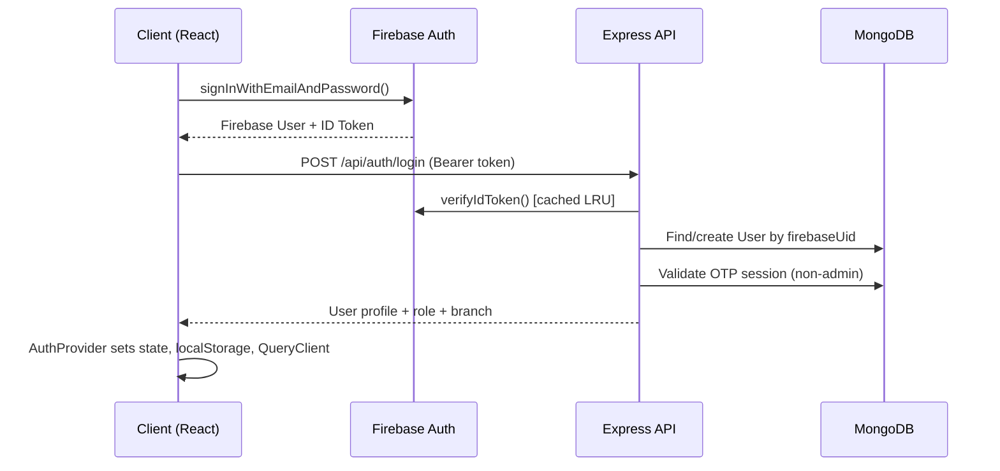

# Lilycrest DMS — Live Architecture Audit

> **Audit Date:** 2026-07-23  
> **Source:** Live codebase structural discovery (not documentation)  
> **Scope:** Full-stack (Express backend, React frontend, mobile sub-app)

---

## 1. High-Level System Overview


### Technology Stack Summary

| Layer | Technology | Version |
|:------|:-----------|:--------|
| **Runtime** | Node.js (ES Modules) | — |
| **Backend Framework** | Express.js | 4.18+ |
| **Frontend Framework** | React | 19.2 |
| **Build Tool** | Vite | 5.4 |
| **CSS** | TailwindCSS | 3.4 |
| **State (Server)** | TanStack React Query | 5.90 |
| **State (Client)** | Zustand | 5.0 |
| **Database** | MongoDB Atlas (Mongoose) | 8.22 |
| **Auth** | Firebase Admin SDK + Client SDK | 12.x |
| **Payments** | PayMongo (webhooks) | — |
| **AI/ML** | Google Generative AI (Gemini) | 0.24 |
| **Real-time** | Socket.IO | 4.8 |
| **Email** | Resend + Nodemailer | — |
| **Testing** | Jest 30 (backend), Playwright (e2e) | — |
| **Animations** | Framer Motion | 12.34 |
| **Charts** | Recharts | 2.15 |
| **PDF** | PDFKit + jsPDF | — |
| **OCR** | Tesseract.js | 5.1 |
| **Validation** | Zod | 4.3 |
| **Logging** | Pino + pino-pretty | 10.3 |

---

## 2. Backend Architecture

### 2.1 Directory Structure (Layer-Based)

```
server/
├── server.js              ← Entry point (bootstrap, middleware pipeline, routes)
├── config/                ← 12 files: DB, Firebase, branches, roles, email, etc.
├── middleware/             ← 10 files: auth, RBAC, permissions, rate limiting, errors
├── models/                ← 29 Mongoose models + index.js barrel
├── controllers/           ← 20 controllers + 17 test files
├── routes/                ← 24 route files + 1 test file
├── services/              ← 5 service modules + 5 test files (AI, billing, analytics)
├── utils/                 ← 56 utility modules + tests (billing engine, scheduler, etc.)
├── validation/            ← 2 files: Zod schemas + validate middleware
├── mobile/                ← Self-contained mobile sub-app (own controllers/routes/middleware)
├── scripts/               ← Migration & seed scripts
└── uploads/               ← Static file storage
```

### 2.2 Architectural Paradigm: **Layered MVC + Domain Utilities**

The backend follows a **layer-based architecture** (not feature-based):
- **Routes** → **Middleware Chain** → **Controllers** → **Models**
- A substantial **utils/** layer acts as a de-facto **service/domain logic** layer

### 2.3 Model Registry (29 Models)

| Category | Models |
|:---------|:-------|
| **Core Business** | User, Room, Reservation, Bill, Stay |
| **Billing** | BillingPeriod, BillingResult, MeterReading, Payment, WaterBillingRecord, UtilityPeriod, UtilityReading |
| **Operations** | MaintenanceRequest, ServiceProvider, BedHistory |
| **Communication** | Announcement, AcknowledgmentAccount, Notification, ChatConversation, ChatMessage |
| **Auth/Session** | UserSession, LoginLog |
| **System** | AuditLog, BusinessSettings, VisitAvailability, BackupConfig, BackupRecord |
| **Inquiry** | Inquiry |

> [!NOTE]
> The KI documentation references 9 models and 18 models respectively. The **actual count is 29**, showing significant schema growth since documentation was last updated.

### 2.4 Controller Complexity Analysis

| Controller | Size (KB) | Concern |
|:-----------|----------:|:--------|
| reservationsController.js | **211** | ⚠️ **God controller** — highest risk |
| maintenanceController.js | **125** | ⚠️ Very large |
| billingController.js | **98** | ⚠️ Very large |
| analyticsController.js | **75** | Large but acceptable (aggregation-heavy) |
| utilityBillingController.js | **66** | Large |
| usersController.js | **43** | Moderate |
| chatController.js | **34** | Moderate |
| authController.js | **33** | Moderate |

### 2.5 Middleware Pipeline (8 Layers)

```
Request → Helmet → RequestId → CORS → RateLimit → Compression → Logger → [Route Auth] → Controller
```

**Auth middleware chain per route:**
1. `verifyToken` — Firebase JWT + in-memory LRU cache + account status check + OTP session validation
2. `verifyAdmin` / `verifyOwner` / `verifyApplicant` — Role gates (Firebase claims → MongoDB fallback)
3. `filterByBranch` — Multi-tenant branch isolation
4. `requirePermission(key)` / `requireAnyPermission([keys])` — Granular RBAC

### 2.6 Background Job Scheduler (14 Cron Jobs)

| Job | Schedule | Purpose |
|:----|:---------|:--------|
| Automated rent generation | Daily 00:00 | Generate monthly bills |
| Overdue move-in detection | Daily 08:30 | Alert on missed deadlines |
| Bed lock cleanup | Every 2 min | Release expired bed holds |
| Overdue bill marking | Daily 01:00 | Transition bill status |
| Penalty computation | Daily 01:10 | Calculate late fees |
| Payment reminders | Daily 08:00 | 5/3/1 day warnings |
| Contract expiration | Daily 09:00 | 30/15/7/1 day alerts |
| Firebase↔MongoDB sync | Daily 03:00 | Orphan cleanup |
| Stale reservation expiry | Hourly :15 | Auto-cancel abandoned bookings |
| No-show cancellation | Daily 10:00 | Cancel after grace period |
| Stale visit warnings | Daily 08:00 | Admin alerts |
| Archive cancelled | Daily 02:00 | Auto-archive old records |
| Scheduled announcements | Periodic | Dispatch timed announcements |
| SLA breach detection | Periodic | Maintenance SLA alerts |
| Auto-backup check | Hourly | Database backup scheduler |

---

## 3. Frontend Architecture

### 3.1 Directory Structure (Feature-Based)

```
web/src/
├── index.js               ← React 19 bootstrap (StrictMode, QueryClient, BrowserRouter)
├── App.js                 ← Provider tree: FirebaseAuth → Auth → Theme → Routes
├── app/
│   ├── lazyPages.js       ← Centralized React.lazy() code splitting (33 pages)
│   └── routes/
│       ├── AppRoutes.jsx  ← Top-level route orchestrator
│       ├── publicRoutes.jsx
│       ├── adminRoutes.jsx   ← Nested under /admin with ProtectedRoute
│       ├── tenantRoutes.jsx
│       └── legacyRoutes.jsx  ← Redirect compatibility
├── features/
│   ├── admin/             ← components/, hooks/, pages/, services/, styles/, utils/
│   ├── tenant/            ← components/, hooks/, modals/, pages/, styles/, utils/
│   ├── public/            ← components/, context/, modals/, pages/, styles/
│   └── super-admin/       ← pages/ (BranchManagement, Roles, Settings)
├── shared/
│   ├── api/               ← 25 domain-specific API modules + httpClient + apiClient barrel
│   ├── components/        ← 34 shared UI components
│   ├── guards/            ← 5 route guards (RequireAuth, RequireAdmin, RequireOwner, etc.)
│   ├── hooks/             ← 9 custom hooks (useAuth, useSocketClient, usePermissions, etc.)
│   ├── stores/            ← 1 Zustand store (notificationStore)
│   ├── lib/               ← queryClient + queryKeys
│   ├── layouts/           ← Layout shells
│   ├── styles/            ← Global styles
│   └── utils/             ← Frontend utilities
├── firebase/              ← Firebase client config
└── registry/              ← UI component registry (magicui)
```

### 3.2 Provider Architecture

```
ReactDOM.createRoot
  └─ StrictMode
     └─ QueryClientProvider (TanStack React Query)
        └─ BrowserRouter
           └─ FirebaseAuthProvider (Firebase onAuthStateChanged)
              └─ AuthProvider (Backend user sync, login/logout, role checks)
                 └─ ThemeProvider
                    └─ AppContent (Suspense + Routes + GlobalLoading + Toast)
```

### 3.3 State Management Strategy

| Concern | Tool | Pattern |
|:--------|:-----|:--------|
| **Server state** | TanStack React Query | queryKeys registry, prefetching, cache invalidation |
| **Auth state** | React Context (useAuth) | Firebase sync → backend profile fetch → context |
| **Client state** | Zustand (minimal) | Only `notificationStore` — 1 store total |
| **Form state** | Local useState | Per-component, no form library |
| **Theme** | React Context | ThemeProvider in public features |

### 3.4 API Layer Architecture

**Two-tier HTTP client:**
1. `httpClient.js` — Core `authFetch()` and `publicFetch()` using native `fetch()` (not Axios)
   - Auto-injects Firebase Bearer token (always fresh)
   - Auto-unwraps `{ success, data, meta }` envelope
   - Auto-retries on 401 (force-refresh token, retry once)
   - Auto-signs out on persistent 401
   - Injects OTP session headers (`X-Device-Id`, `X-Session-Id`)
2. `apiClient.js` — Barrel re-export hub for 15 domain API modules
3. Domain modules (e.g., `reservationApi.js`) — Pure function objects, no class instances

### 3.5 Routing & Code Splitting

- **33 lazy-loaded pages** via `React.lazy()` in centralized `lazyPages.js`
- **4 route groups:** Public, Admin, Tenant, Legacy (redirects)
- **5 route guards:** RequireAuth, RequireAdmin, RequireOwner, RequireNonAdmin, RequireSuperAdmin
- **Legacy redirect support** — 8 redirect routes for deprecated URLs

---

## 4. Design Pattern Evaluation

### 4.1 Patterns Implemented Well ✅

| Pattern | Implementation | Notes |
|:--------|:---------------|:------|
| **Standardized API envelope** | `sendSuccess()` / `sendError()` + `AppError` class | Consistent `{ success, data/error, meta }` across all endpoints |
| **Firebase + MongoDB dual-auth** | Custom claims (fast path) → DB fallback | Resilient to stale claims |
| **Multi-tenant branch isolation** | `filterByBranch` middleware + `getUserBranchInfo()` | Owner bypasses, admin scoped |
| **Granular RBAC** | `requirePermission()` / `requireAnyPermission()` | 8 permission keys, startup backfill |
| **In-memory token cache** | SHA-256 keyed LRU Map with TTL | Saves ~200ms/request |
| **Centralized model barrel** | `models/index.js` with named + default exports | Single import source |
| **Domain-decomposed API layer** | 25 separate API modules behind barrel | Clean separation of concerns |
| **Code splitting** | Centralized `lazyPages.js` with Suspense | All 33 pages lazy-loaded |
| **Cron scheduler** | node-cron with retry + admin alerting | Production-grade job system |
| **Graceful shutdown** | SIGTERM/SIGINT handlers + MongoDB close | Proper cleanup with timeout |

### 4.2 Anti-Patterns & Issues Found ⚠️

#### CRITICAL: God Controller

> [!CAUTION]
> `reservationsController.js` at **211 KB** (5,000+ lines estimated) is the single largest risk in the codebase. It likely contains reservation creation, status transitions, visit management, cancellation flows, archival, occupancy sync, and move-out logic all in one file.

**Impact:** Merge conflicts, cognitive overload, testing difficulty, deployment risk.

#### HIGH: Blurred Service/Utility Boundary

The `server/utils/` directory contains **56 files** performing roles that span:
- **Domain services** (`billingEngine.js`, `occupancyManager.js`, `tenantWorkspace.js`)
- **Pure utilities** (`sanitize.js`, `roomLabel.js`)
- **Infrastructure** (`scheduler.js`, `socket.js`, `pdfGenerator.js`)
- **Business rules** (`billingPolicy.js`, `utilityFlowRules.js`, `penaltyCalculator.js`)

This directory has become a catch-all. The actual `services/` directory has only 5 files and is underutilized.

#### HIGH: Dual HTTP Client Confusion

Two HTTP abstractions coexist:
- `httpClient.js` — Uses native `fetch()`, is the actual client used everywhere
- `apiClient.js` — Acts only as a barrel re-export, but its name implies it's a client

Additionally, `axios` is listed as a frontend dependency (`^1.13.4`) but the codebase uses native `fetch()`. Axios appears to be a dead dependency.

#### MEDIUM: Inconsistent Response Patterns in Auth Middleware

The auth middleware (`auth.js`) uses raw `res.status().json()` directly, while the error handler middleware uses the standardized `sendError()` helper. This creates two different error shapes for auth failures vs. business logic failures.

```javascript
// auth.js — raw shape
res.status(401).json({ error: "...", code: "..." })

// errorHandler.js — standardized shape
sendError(res, "...", 401, "...", details)
// → { success: false, error: { code, message, details }, meta: {...} }
```

#### MEDIUM: Minimal Zustand Usage

Zustand is a dependency with only **1 store** (`notificationStore`). Given TanStack React Query handles all server state, the Zustand dependency adds bundle weight for minimal value. The notification store could likely be a React Query subscription or a simple Context.

#### MEDIUM: Frontend Page Component Sizes

Several admin pages are extremely large single-file components:

| Component | Size (KB) |
|:----------|----------:|
| AdminMaintenancePage.jsx | **192** |
| RoomAvailabilityPage.jsx | **52** |
| UserManagementPage.jsx | **45** |
| ReservationsPage.jsx | **44** |
| TenantsWorkspacePage.jsx | **43** |
| AdminAnnouncementsPage.jsx | **42** |
| AnalyticsPage.jsx | **40** |
| AdminChatPage.jsx | **40** |

These monolithic page components likely contain data fetching, state management, modal logic, and rendering all inline.

#### LOW: Mobile Sub-App Duplication

The `server/mobile/` directory contains its own `controllers/`, `routes/`, `middleware/`, `services/`, `config/`, and `utils/` — a parallel structure to the main server. This creates risk of logic drift between web and mobile code paths for shared operations (e.g., maintenance requests).

#### LOW: Stale Files & Scripts

Multiple diagnostic/test scripts exist at the server root: `check.js`, `check_db.js`, `check-endpoint.js`, `test-endpoint.js`, `test3.cjs`, `test_delete.cjs`, `script.cjs`. These appear to be ad-hoc debug artifacts.

---

## 5. Data Flow Analysis

### 5.1 Authentication Flow



### 5.2 Reservation Lifecycle

```
pending → visit_pending → visit_approved → payment_pending → reserved → checked_in → moved_out
                                                                ↓
                                                           cancelled (at any pre-move-in stage)
```

Status transitions are governed by `lifecycleNaming.js` with canonical status normalization and validated transition rules via `canTransitionReservationStatus()`.

### 5.3 Billing Data Flow

```
Reservation (checked_in) → Scheduler (midnight) → rentGenerator.js → Bill creation
                                                 → billingEngine.js → Amount calculation
                                                 → billingPolicy.js → Status resolution
                                                 → penaltyCalculator.js → Late fee computation
```

---

## 6. Strategic Recommendations

### 6.1 Critical Priority

#### 1. Decompose `reservationsController.js` (211 KB)

Split into domain-focused controller modules:

```
controllers/reservations/
├── index.js                    ← Re-exports for backward compat
├── reservationCrudController.js
├── reservationLifecycleController.js
├── visitManagementController.js
├── cancellationController.js
├── tenantWorkspaceController.js
└── occupancyController.js      ← Already exists, extend
```

#### 2. Restructure `utils/` into Proper Service Layers

```
server/
├── services/
│   ├── billing/          ← billingEngine, billingPolicy, penaltyCalculator, rentGenerator
│   ├── occupancy/        ← occupancyManager, bedLockCleanup
│   ├── notifications/    ← notificationService, mobilePush, announcementDispatch
│   ├── scheduling/       ← scheduler, gracePeriodJob, slaAlertJob
│   ├── ai/               ← analyticsInsights, billingIntelligence, maintenanceAi
│   └── reservations/     ← reservationHelpers, visitAvailability, tenantActionService
├── utils/                ← Pure utilities only (sanitize, roomLabel, etc.)
└── infra/                ← socket, pdfGenerator, email templates
```

### 6.2 High Priority

#### 3. Standardize Auth Error Responses

Wrap all auth middleware responses in `sendError()` to ensure uniform `{ success, error: { code, message } }` shape across the entire API surface.

#### 4. Decompose Monolithic Page Components

Extract `AdminMaintenancePage.jsx` (192 KB) and other large pages into composition patterns:

```
features/admin/pages/maintenance/
├── AdminMaintenancePage.jsx      ← Orchestrator only
├── MaintenanceTable.jsx
├── MaintenanceFilters.jsx
├── MaintenanceDetailModal.jsx
├── MaintenanceCreateForm.jsx
└── hooks/
    ├── useMaintenanceQuery.js
    └── useMaintenanceActions.js
```

### 6.3 Medium Priority

#### 5. Audit and Remove Dead Dependencies

- **Axios** (`web/package.json`) — Frontend uses native `fetch()` via `httpClient.js`. Remove unless mobile or scripts depend on it.
- Rename `apiClient.js` to `apiBarrel.js` or `index.js` to clarify it's a re-export hub, not a client.

#### 6. Evaluate Zustand Necessity

With only 1 store (`notificationStore`), consider migrating to React Query's built-in subscription mechanism or a simple React Context to eliminate the dependency.

#### 7. Clean Up Root-Level Scripts

Archive or remove: `check.js`, `check_db.js`, `check-endpoint.js`, `test-endpoint.js`, `test3.cjs`, `test_delete.cjs`, `script.cjs`, `old_elec.js`, `old_elec_utf8.js`.

### 6.4 Scaling Considerations

#### 8. Mobile/Web Logic Unification

Create shared service modules that both the web routes and mobile routes consume, eliminating the parallel controller/service structure in `server/mobile/`.

#### 9. Database Index Audit

With 29 models and complex aggregation pipelines (analytics, billing), conduct a MongoDB index coverage audit using `explain()` on the heaviest queries (analytics dashboard, billing generation, reservation listing).

#### 10. API Versioning Preparation

The current API has no versioning prefix (all routes are `/api/*`). For future breaking changes, consider introducing `/api/v1/*` namespacing at the router level.

---

## 7. Quantitative Summary

| Metric | Count |
|:-------|------:|
| Mongoose Models | **29** |
| Backend Controllers | **20** |
| Backend Route Files | **24** |
| Middleware Modules | **10** |
| Backend Utility Modules | **56** |
| Backend Service Modules | **5** |
| Frontend API Modules | **25** |
| Frontend Feature Modules | **4** (admin, tenant, public, super-admin) |
| Lazy-Loaded Pages | **33** |
| Route Guards | **5** |
| Custom Hooks | **9** |
| Background Cron Jobs | **14** |
| Zustand Stores | **1** |
| Backend Test Files | **~25** |

---

> [!IMPORTANT]
> The KI documentation is significantly outdated — it references 9 models vs. the actual 29, and 16 controllers vs. the actual 20. This audit should serve as the new architectural baseline.
