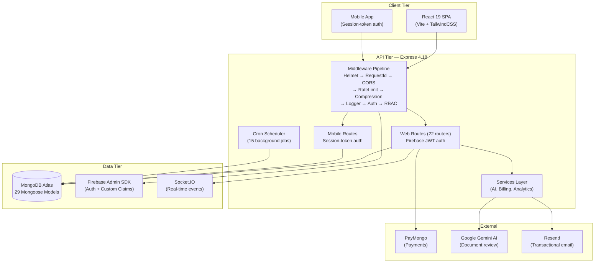
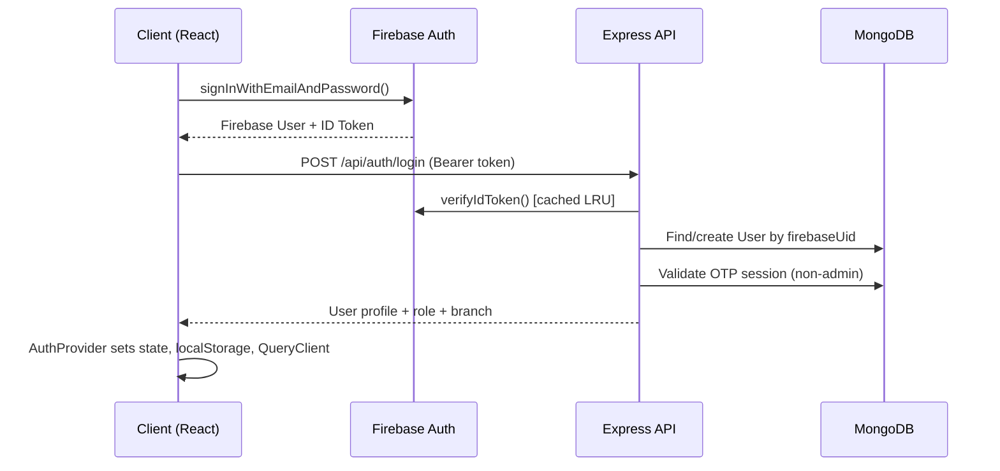

# Lilycrest DMS — Live Architecture Audit

> **Audit Date:** 2026-07-23  
> **Source:** Live codebase structural discovery (not documentation)  
> **Scope:** Full-stack (Express backend, React frontend, mobile sub-app)

---

## 1. High-Level System Overview



### Technology Stack Summary

| Layer | Technology | Version |
|:------|:-----------|:--------|
| **Runtime** | Node.js (ES Modules) | — |
| **Backend Framework** | Express.js | 4.18+ |
| **Frontend Framework** | React | 19.2 |
| **Build Tool** | Vite | 5.4 |
| **CSS** | TailwindCSS | 3.4 |
| **State (Server)** | TanStack React Query | 5.90 |
| **State (Client)** | Zustand | 5.0 |
| **Database** | MongoDB Atlas (Mongoose) | 8.22 |
| **Auth** | Firebase Admin SDK + Client SDK | 12.x |
| **Payments** | PayMongo (webhooks) | — |
| **AI/ML** | Google Generative AI (Gemini) | 0.24 |
| **Real-time** | Socket.IO | 4.8 |
| **Email** | Resend + Nodemailer | — |
| **Testing** | Jest 30 (backend), Playwright (e2e) | — |
| **Animations** | Framer Motion | 12.34 |
| **Charts** | Recharts | 2.15 |
| **PDF** | PDFKit + jsPDF | — |
| **OCR** | Tesseract.js | 5.1 |
| **Validation** | Zod | 4.3 |
| **Logging** | Pino + pino-pretty | 10.3 |

---

## 2. Backend Architecture

### 2.1 Directory Structure (Layer-Based)

```
server/
├── server.js              ← Entry point (bootstrap, middleware pipeline, routes)
├── config/                ← 12 files: DB, Firebase, branches, roles, email, etc.
├── middleware/             ← 10 files: auth, RBAC, permissions, rate limiting, errors
├── models/                ← 29 Mongoose models + index.js barrel
├── controllers/           ← 20 root proxies + 17 specialized subcontrollers
│   ├── reservations/      ← 7 subcontrollers + _helpers.js + barrel index.js
│   ├── maintenance/       ← 5 subcontrollers + _helpers.js + barrel index.js
│   └── billing/           ← 4 subcontrollers + _helpers.js + barrel index.js
├── routes/                ← 24 route files + 1 test file
├── services/              ← Domain services (billing, occupancy, notifications, maintenance, audit) + AI services
│   ├── billing/           ← billingEngine, billingPolicy, rentGenerator, penaltyCalculator, etc.
│   ├── occupancy/         ← occupancyManager, bedLockCleanup
│   ├── notifications/     ← notificationService, mobilePushService, etc.
│   ├── maintenance/       ← maintenanceAiService, maintenanceAnalyticsService
│   └── audit/             ← auditLogger
├── utils/                 ← Pure utilities (sanitize, roomLabel, etc.) & backward-compat proxies
├── validation/            ← 2 files: Zod schemas + validate middleware
├── mobile/                ← Self-contained mobile sub-app (own controllers/routes/middleware)
├── scripts/               ← Migration & seed scripts + archived debug scripts
│   └── archived/          ← Archived root debug scripts
└── uploads/               ← Static file storage
```

### 2.2 Architectural Paradigm: **Layered MVC + Domain Services**

The backend follows a **layer-based architecture**:
- **Routes** → **Middleware Chain** → **Controllers (Proxies + Subcontrollers)** → **Domain Services** → **Models**
- Key business and domain workflows previously in `utils/` are now structured in `services/<domain>/`.

### 2.3 Model Registry (29 Models)

| Category | Models |
|:---------|:-------|
| **Core Business** | User, Room, Reservation, Bill, Stay |
| **Billing** | BillingPeriod, BillingResult, MeterReading, Payment, WaterBillingRecord, UtilityPeriod, UtilityReading |
| **Operations** | MaintenanceRequest, ServiceProvider, BedHistory |
| **Communication** | Announcement, AcknowledgmentAccount, Notification, ChatConversation, ChatMessage |
| **Auth/Session** | UserSession, LoginLog |
| **System** | AuditLog, BusinessSettings, VisitAvailability, BackupConfig, BackupRecord |
| **Inquiry** | Inquiry |

---

### 2.4 Controller Complexity Analysis

| Controller | Size (KB) | Concern / Status |
|:-----------|----------:|:-----------------|
| billingController.js | **100** | ⚠️ Very large (Target for Phase 4 refactoring) |
| analyticsController.js | **77** | Large but acceptable (aggregation-heavy) |
| utilityBillingController.js | **67** | Large |
| usersController.js | **44** | Moderate |
| chatController.js | **34** | Moderate |
| authController.js | **34** | Moderate |
| reservationsController.js | **<1** (Proxy) | ✅ **RESOLVED** — Decomposed into `controllers/reservations/` (7 subcontrollers) |
| maintenanceController.js | **<1** (Proxy) | ✅ **RESOLVED** — Decomposed into `controllers/maintenance/` (5 subcontrollers) |

---

### 2.5 Middleware Pipeline (8 Layers)

```
Request → Helmet → RequestId → CORS → RateLimit → Compression → Logger → [Route Auth] → Controller
```

**Auth middleware chain per route:**
1. `verifyToken` — Firebase JWT + in-memory LRU cache + account status check + OTP session validation
2. `verifyAdmin` / `verifyOwner` / `verifyApplicant` — Role gates (Firebase claims → MongoDB fallback)
3. `filterByBranch` — Multi-tenant branch isolation
4. `requirePermission(key)` / `requireAnyPermission([keys])` — Granular RBAC

---

### 2.6 Background Job Scheduler (15 Cron Jobs)

| Job | Schedule | Purpose |
|:----|:---------|:--------|
| Automated rent generation | Daily 00:00 | Generate monthly bills |
| Overdue move-in detection | Daily 08:30 | Alert on missed deadlines |
| Bed lock cleanup | Every 2 min | Release expired bed holds |
| Overdue bill marking | Daily 01:00 | Transition bill status |
| Penalty computation | Daily 01:10 | Calculate late fees |
| Consecutive overdue detection | Daily 01:20 | 3-month overdue termination flag |
| Payment reminders | Daily 08:00 | 5/3/1 day warnings |
| Contract expiration | Daily 09:00 | 30/15/7/1 day alerts |
| Firebase↔MongoDB sync | Daily 03:00 | Orphan cleanup |
| Stale reservation expiry | Hourly :15 | Auto-cancel abandoned bookings |
| No-show cancellation | Daily 10:00 | Cancel after grace period |
| Stale visit warnings | Daily 08:00 | Admin alerts |
| Archive cancelled | Daily 02:00 | Auto-archive old records |
| Scheduled announcements | Periodic | Dispatch timed announcements |
| SLA breach detection | Periodic | Maintenance SLA alerts |
| Auto-backup check | Hourly | Database backup scheduler |

---

## 3. Frontend Architecture

### 3.1 Directory Structure (Feature-Based)

```
web/src/
├── index.js               ← React 19 bootstrap (StrictMode, QueryClient, BrowserRouter)
├── App.js                 ← Provider tree: FirebaseAuth → Auth → Theme → Routes
├── app/
│   ├── lazyPages.js       ← Centralized React.lazy() code splitting (33 pages)
│   └── routes/
│       ├── AppRoutes.jsx  ← Top-level route orchestrator
│       ├── publicRoutes.jsx
│       ├── adminRoutes.jsx   ← Nested under /admin with ProtectedRoute
│       ├── tenantRoutes.jsx
│       └── legacyRoutes.jsx  ← Redirect compatibility
├── features/
│   ├── admin/             ← components/, hooks/, pages/, services/, styles/, utils/
│   ├── tenant/            ← components/, hooks/, modals/, pages/, styles/, utils/
│   ├── public/            ← components/, context/, modals/, pages/, styles/
│   └── super-admin/       ← pages/ (BranchManagement, Roles, Settings)
├── shared/
│   ├── api/               ← 25 domain-specific API modules + httpClient + apiClient barrel
│   ├── components/        ← 34 shared UI components
│   ├── guards/            ← 5 route guards (RequireAuth, RequireAdmin, RequireOwner, etc.)
│   ├── hooks/             ← 9 custom hooks (useAuth, useSocketClient, usePermissions, etc.)
│   ├── stores/            ← 1 Zustand store (notificationStore)
│   ├── lib/               ← queryClient + queryKeys
│   ├── layouts/           ← Layout shells
│   ├── styles/            ← Global styles
│   └── utils/             ← Frontend utilities
├── firebase/              ← Firebase client config
└── registry/              ← UI component registry (magicui)
```

### 3.2 Provider Architecture

```
ReactDOM.createRoot
  └─ StrictMode
     └─ QueryClientProvider (TanStack React Query)
        └─ BrowserRouter
           └─ FirebaseAuthProvider (Firebase onAuthStateChanged)
              └─ AuthProvider (Backend user sync, login/logout, role checks)
                 └─ ThemeProvider
                    └─ AppContent (Suspense + Routes + GlobalLoading + Toast)
```

### 3.3 State Management Strategy

| Concern | Tool | Pattern |
|:--------|:-----|:--------|
| **Server state** | TanStack React Query | queryKeys registry, prefetching, cache invalidation |
| **Auth state** | React Context (useAuth) | Firebase sync → backend profile fetch → context |
| **Client state** | Zustand (minimal) | Only `notificationStore` — 1 store total |
| **Form state** | Local useState | Per-component, no form library |
| **Theme** | React Context | ThemeProvider in public features |

---

### 3.4 API Layer Architecture

**Two-tier HTTP client:**
1. `httpClient.js` — Core `authFetch()` and `publicFetch()` using native `fetch()` (not Axios)
   - Auto-injects Firebase Bearer token (always fresh)
   - Auto-unwraps `{ success, data, meta }` envelope
   - Auto-retries on 401 (force-refresh token, retry once)
   - Auto-signs out on persistent 401
   - Injects OTP session headers (`X-Device-Id`, `X-Session-Id`)
2. `apiClient.js` — Barrel re-export hub for 15 domain API modules
3. Domain modules (e.g., `reservationApi.js`) — Pure function objects, no class instances

### 3.5 Routing & Code Splitting

- **33 lazy-loaded pages** via `React.lazy()` in centralized `lazyPages.js`
- **4 route groups:** Public, Admin, Tenant, Legacy (redirects)
- **5 route guards:** RequireAuth, RequireAdmin, RequireOwner, RequireNonAdmin, RequireSuperAdmin
- **Legacy redirect support** — 8 redirect routes for deprecated URLs

---

## 4. Design Pattern Evaluation

### 4.1 Patterns Implemented Well ✅

| Pattern | Implementation | Notes |
|:--------|:---------------|:------|
| **Standardized API envelope** | `sendSuccess()` / `sendError()` + `AppError` class | Consistent `{ success, data/error, meta }` across all endpoints |
| **Firebase + MongoDB dual-auth** | Custom claims (fast path) → DB fallback | Resilient to stale claims |
| **Multi-tenant branch isolation** | `filterByBranch` middleware + `getUserBranchInfo()` | Owner bypasses, admin scoped |
| **Granular RBAC** | `requirePermission()` / `requireAnyPermission()` | 8 permission keys, startup backfill |
| **In-memory token cache** | SHA-256 keyed LRU Map with TTL | Saves ~200ms/request |
| **Centralized model barrel** | `models/index.js` with named + default exports | Single import source |
| **Domain-decomposed API layer** | 25 separate API modules behind barrel | Clean separation of concerns |
| **Decomposed Controller Proxies** | Barrel proxies for `reservationsController` & `maintenanceController` | Clean modularity with zero breaking API changes |
| **Domain Services Layer** | Modular `services/` subdirectories (`billing`, `occupancy`, etc.) | Clear separation of business logic from pure utils |
| **Code splitting** | Centralized `lazyPages.js` with Suspense | All 33 pages lazy-loaded |
| **Cron scheduler** | node-cron with retry + admin alerting | Production-grade job system |
| **Graceful shutdown** | SIGTERM/SIGINT handlers + MongoDB close | Proper cleanup with timeout |
| **Lease Contract Rules Engine** | Schema fields + scheduler job + move-out workflow | Deposit forfeiture, termination eligibility flag, lease date anniversary alignment |

---

### 4.2 Anti-Patterns & Issues Audit Status ⚠️

#### RESOLVED: God Controllers (`reservationsController.js` & `maintenanceController.js`)

> [!NOTE]
> `reservationsController.js` (previously 211 KB) and `maintenanceController.js` (previously 125 KB) have been fully decomposed into specialized domain subcontrollers under `server/controllers/reservations/` and `server/controllers/maintenance/`. The root controller files remain as thin backward-compatibility proxies.

#### RESOLVED: Blurred Service/Utility Boundary

> [!NOTE]
> Domain logic modules previously residing in `server/utils/` (`billingEngine.js`, `occupancyManager.js`, `notificationService.js`, `auditLogger.js`, etc.) have been migrated to domain packages under `server/services/`. Root `utils/` imports act as backward-compatibility proxies.

#### HIGH: Dual HTTP Client Confusion

Two HTTP abstractions coexist:
- `httpClient.js` — Uses native `fetch()`, is the actual client used everywhere
- `apiClient.js` — Acts only as a barrel re-export, but its name implies it's a client

Additionally, `axios` is listed as a frontend dependency (`^1.13.4`) but the codebase uses native `fetch()`. Axios appears to be a dead dependency.

#### RESOLVED: Inconsistent Response Patterns in Auth Middleware

> [!NOTE]
> The auth middleware (`auth.js`) has been refactored to use standardized `sendError()` helpers, matching the uniform error envelope across the API.

#### MEDIUM: Minimal Zustand Usage

Zustand is a dependency with only **1 store** (`notificationStore`). Given TanStack React Query handles all server state, the Zustand dependency adds bundle weight for minimal value. The notification store could likely be a React Query subscription or a simple Context.

#### MEDIUM: Frontend Page Component Sizes

Several admin pages are extremely large single-file components:

| Component | Size (KB) |
|:----------|----------:|
| AdminMaintenancePage.jsx | **192** |
| RoomAvailabilityPage.jsx | **52** |
| UserManagementPage.jsx | **45** |
| ReservationsPage.jsx | **44** |
| TenantsWorkspacePage.jsx | **43** |
| AdminAnnouncementsPage.jsx | **42** |
| AnalyticsPage.jsx | **40** |
| AdminChatPage.jsx | **40** |

These monolithic page components likely contain data fetching, state management, modal logic, and rendering all inline.

#### LOW: Mobile Sub-App Duplication

The `server/mobile/` directory contains its own `controllers/`, `routes/`, `middleware/`, `services/`, `config/`, and `utils/` — a parallel structure to the main server. This creates risk of logic drift between web and mobile code paths for shared operations (e.g., maintenance requests).

#### RESOLVED: Stale Files & Scripts

> [!NOTE]
> All root diagnostic and test scripts (`check.js`, `check_db.js`, `check-endpoint.js`, `test-endpoint.js`, `test3.cjs`, `test_delete.cjs`, `script.cjs`, `test-counts.js`) have been archived into `server/scripts/archived/`.

---

## 5. Data Flow Analysis

### 5.1 Authentication Flow



### 5.2 Reservation Lifecycle

```
pending → visit_pending → visit_approved → payment_pending → reserved → checked_in → moved_out
                                                                ↓
                                                           cancelled (at any pre-move-in stage)
```

Status transitions are governed by `lifecycleNaming.js` with canonical status normalization and validated transition rules via `canTransitionReservationStatus()`.

### 5.3 Billing Data Flow

```
Reservation (checked_in) → Scheduler (midnight) → rentGenerator.js → Bill creation
                                                 → billingEngine.js → Amount calculation
                                                 → billingPolicy.js → Status resolution
                                                 → penaltyCalculator.js → Late fee computation
```

### 5.4 Move-Out & Deposit Settlement Flow (Lease Contract Rules)

```
Admin triggers Move-Out
  → moveOutStayWorkflow() [tenantActionService.js]
      → Validate: status = 'moveIn', confirm = true, finalUtilityReading provided
      → Check moveOutAt vs activeStay.leaseEndDate
          → Early Vacancy? (moveOutAt < leaseEndDate)
              YES → depositForfeited = true
                    depositForfeitureReason = 'early_vacancy'
                    depositRefundAmount = 0
                    depositRefundDeadline = null
              NO  → depositForfeited = false
                    depositRefundDeadline = moveOutDate + 30 days
                    depositRefundAmount = null (pending admin settlement)
      → Stay.status = 'completed' | 'terminated'
      → Reservation.status = 'moveOut'
      → Room bed vacated + occupancy decremented
      → UtilityReading created (final meter reading)
      → depositSettlement object returned in API response

Scheduler (daily 01:20) → detectConsecutiveOverdueMonths()
  → For each active (moveIn) reservation:
      → Fetch bills sorted by billingMonth DESC
      → Count streak of consecutive months with overdue/unpaid balance
      → streak >= 3 → eligibleForTermination = true
                       terminationEligibilityDetectedAt = now
                       Alert all branch admins via notify.general()
      → streak < 3 (was eligible) → eligibleForTermination = false (auto-clears)
```

### 5.5 Lease Contract Renewal Offer Flow

```
Admin (Tenants Workspace)
  → Opens RenewLeaseModal → Selects "Send Official Offer"
  → Enters offer duration (e.g. 6 months), proposed rate (PHP), expiry date, notes
  → POST /api/reservations/:id/renewal-offer [createRenewalOffer]
      → Appends offer object to Reservation.renewalOffers schema array
      → Sends push notification & in-app notification to tenant

Tenant (My Contract Tab)
  → GET /api/reservations/my-renewal-offers [getMyRenewalOffers]
  → Sees interactive "Official Lease Renewal Offer" card
  → Chooses "Accept Renewal" or "Decline" (with decline reason modal)
      → POST /api/reservations/:id/renewal-offer/:offerId/respond [respondToRenewalOffer]
          → If Accepted:
              → Calls renewStayWorkflow() in tenantActionService.js
              → Extends stay & reservation lease dates automatically
              → Creates audit log & notifies admin
          → If Declined:
              → Updates offer status to 'declined' with tenantResponseReason
              → Notifies branch admins
```

---

## 6. Strategic Recommendations

### 6.1 Critical Priority

#### 1. Decompose `reservationsController.js` (211 KB) — ✅ COMPLETED

Split into domain-focused controller modules under `server/controllers/reservations/`:
- `index.js` (barrel export)
- `reservationCrudController.js`
- `reservationLifecycleController.js`
- `visitManagementController.js`
- `cancellationController.js`
- `tenantWorkspaceController.js`
- `tenancyActionsController.js`
- `_helpers.js`

#### 2. Restructure `utils/` into Proper Service Layers — ✅ COMPLETED

Migrated domain services from `utils/` into `server/services/`:
- `services/billing/` (billingEngine, billingPolicy, penaltyCalculator, rentGenerator, billSettlement, billingAudit, paymentLedger)
- `services/occupancy/` (occupancyManager, bedLockCleanup)
- `services/notifications/` (notificationService, notificationVisibility, mobilePushService, announcementDispatch)
- `services/maintenance/` (maintenanceAiService, maintenanceAnalyticsService)
- `services/audit/` (auditLogger)

#### 3. Lease Contract Rules Integration — ✅ COMPLETED

Translated physical lease contract into system rules across 4 phases:
- **Phase 1:** Reservation fee deductible — `buildReservationPricing()` in `_helpers.js` exposes `moveInCashOut` envelope; `ReservationPaymentStep.jsx` renders Move-In Financial Breakdown.
- **Phase 2:** Deposit forfeiture on early vacancy — 7 new fields on `Reservation.js`; `moveOutStayWorkflow()` in `tenantActionService.js` auto-sets forfeiture vs. 30-day refund deadline; `depositSettlement` returned in move-out API response.
- **Phase 3:** 3-consecutive-month overdue termination flag — 4 new fields on `Reservation.js`; new cron Job 4b (`detectConsecutiveOverdueMonths`, daily 01:20) sets `eligibleForTermination: true` and alerts branch admins.
- **Phase 4:** Lease date anniversary alignment — `computeLeaseEndDate()` in `tenantWorkspace.js` subtracts 1 day so Aug 20 + 6 months → Feb 19, not Feb 20. Unit tests updated and passing.

#### 4. Lease Contract Renewal Offer System — ✅ COMPLETED

Implemented structured lease renewal proposal and resident acceptance lifecycle:
- **Schema:** Added `renewalOffers` schema array to `Reservation.js` (`offerId`, `months`, `proposedRent`, `status`, `expiresAt`, `createdAt`, `createdBy`, `tenantResponseReason`).
- **Backend:** Created 4 domain endpoints (`createRenewalOffer`, `cancelRenewalOffer`, `respondToRenewalOffer`, `getMyRenewalOffers`) in `tenancyActionsController.js`.
- **Tenant Portal:** Updated `ContractTab.jsx` to render an interactive Renewal Offer card with Accept / Decline options and response prompt.
- **Admin Workspace:** Enhanced `RenewLeaseModal` in `TenantWorkspaceModals.jsx` to support dual modes: Direct Renewal vs. Send Official Renewal Offer.

### 6.2 High Priority

#### 5. Standardize Auth Error Responses — ✅ COMPLETED

Refactored `middleware/auth.js` to wrap responses in `sendError()` helper for uniform API responses.

#### 6. Decompose Monolithic Page Components — 🟡 PLANNED

Extract `AdminMaintenancePage.jsx` (192 KB) and other large pages into composition patterns.

### 6.3 Medium Priority

#### 7. Audit and Remove Dead Dependencies — 🟡 PLANNED

- **Axios** (`web/package.json`) — Frontend uses native `fetch()` via `httpClient.js`.
- Rename `apiClient.js` to `apiBarrel.js` or `index.js` to clarify it's a re-export hub.

#### 8. Evaluate Zustand Necessity — 🟡 PLANNED

With only 1 store (`notificationStore`), evaluate migrating to React Query subscriptions or React Context.

#### 9. Clean Up Root-Level Scripts — ✅ COMPLETED

Moved root debug scripts (`check.js`, `check_db.js`, `check-endpoint.js`, `test-endpoint.js`, `test3.cjs`, `test_delete.cjs`, `script.cjs`, `test-counts.js`) to `server/scripts/archived/`.

### 6.4 Scaling Considerations

#### 10. Mobile/Web Logic Unification
#### 11. Database Index Audit
#### 12. API Versioning Preparation

---

## 7. Quantitative Summary

| Metric | Count | Notes |
|:-------|------:|:------|
| Mongoose Models | **29** | Core database schemas |
| Backend Root Controllers | **20** | Facade/proxy modules for backward compat |
| Backend Subcontrollers | **13** | Specialized domain subcontrollers (`reservations/` & `maintenance/`) |
| Backend Route Files | **24** | Express routers |
| Middleware Modules | **10** | Pipeline layers |
| Backend Service Packages | **5** | Domain service packages (`billing`, `occupancy`, `notifications`, `maintenance`, `audit`) |
| Frontend API Modules | **25** | Domain-specific API services |
| Frontend Feature Modules | **4** | admin, tenant, public, super-admin |
| Lazy-Loaded Pages | **33** | Suspense split pages |
| Route Guards | **5** | RBAC & auth guards |
| Custom Hooks | **9** | Shared React hooks |
| Background Cron Jobs | **15** | Scheduled system jobs |
| Zustand Stores | **1** | Client state store |
| Backend Test Suites | **41** | 343 unit/integration tests passing (100%) |
| Net New Reservation Schema Fields | **19** | Added for contract rules (7 deposit + 4 termination + 8 renewal offer) |

---

> [!IMPORTANT]
> This audit reflects the live codebase structure following modular refactoring of controllers, service layer restructuring, auth error standardization, root script archiving, full lease contract rule integration (Phases 1–4), and the complete Lease Contract Renewal Offer system. All 41 test suites (343 tests) verified passing as of 2026-07-24.
